# 数据库系统 战德臣
## 第2讲 数据库系统的结构抽象与演变
### 数据与模式
**模式**：对数据库中数据所进行的一种结构性的描述/所观察到的数据的结构信息，是对视图的抽象。  
**视图/数据**：某一种表现形式下表现出来的数据库中的数据。  
**数据库的标准结构**：三级模式、两层映像  
#### 三级模式
 * **外模式**： 对用户所看到的局部的数据的一种描述。  
 * **概念模式**：数据之间内在的本质的联系（全局性的）。  
 * **内模式（物理模式）**：存储在介质上的数据的结构描述。  
#### 两层映像
 * **E-C映像**：外模式映射为概念模式的映像，实现转换，便于用户观察和使用。  
 * **C-I映像**：概念模式映射为内模式的映像，便于计算机存储和数据的处理。  
#### 两个独立性（三级模式、两层映像所实现）
避免应用程序在开发时不断修改  
 * **逻辑数据独立性**：概念模式变化时，可以不改变外部模式（只改变E-C Mapping），从而无需改变应用程序。  
 * **物理数据独立性**：内部模式变化时，可以不改变概念模式（只改变C-I Mapping），从而不改变外部模式。  
### 数据模型
**数据模型**：规定模式统一描述方式的模型，包括：数据结构、操作和约束，是对模式本身结构的抽象（而模式是对数据本身结构形式的抽象）。  
**ep. 关系模型**：所有模式都可为抽象表的形式\[数据结构\]，而每一个具体的模式都是拥有不同列名的具体的表。对这些表形式的数据有哪些\[操作\]和\[约束\]。  
**ep. 理解**：模式指代一定数据结构组成的抽象表（是对于数据的结构的抽象），数据模型则定义了其统一描述的方式（是对模式的结构的抽象）。  
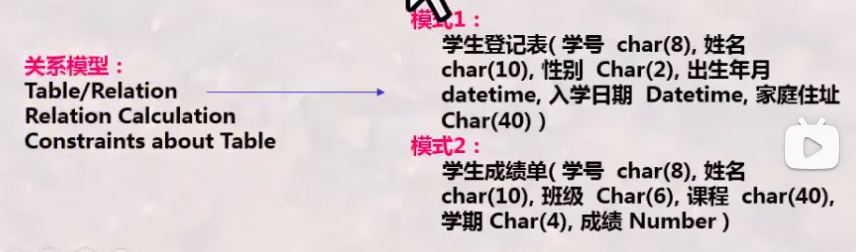  
#### 三大经典数据模型
 * 关系模型：表的形式组织数据（传统模式）
 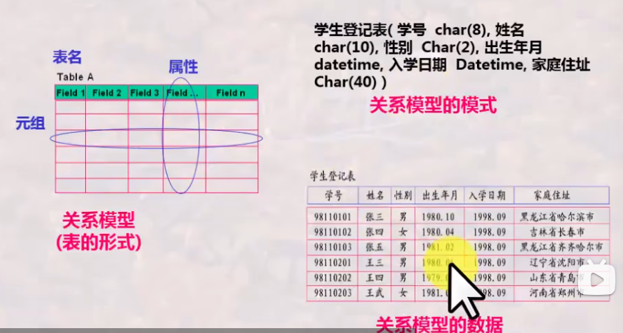
 * 层次模型：树的形式组织数据（实体型-系型,即节点-线，以指针指向记录）
   
 PS: 模式可以理解为表头?
 * 网状模型：图的形式组织数据（实体型-系型,即节点-线，与层次模型类似，如今使用不多）
 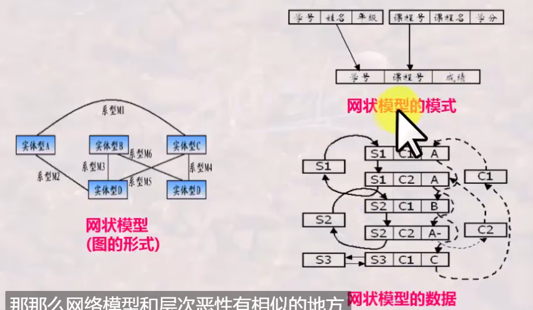  
 PS：网状模型中指针需要用户建立。
### 发展史 30:00
#### 数据库技术的简要发展史
 * 数据库技术探索阶段(59-65/67)：正式提出Database概念
 * 数据库技术确立阶段(65/68-75)：研究形成关系数据库理论基础，开始商用
 * 数据库技术成熟阶段(76-80s前期)：提出标准化数据库系统结构模型，关系理论日益完善，应用普及
 * 数据库技术深化发展阶段(85年以来)：数据库方法逐步理论化，设计理论不断完善，出现面向各行各业的专用数据库
#### 演变与发展
 1. 文件系统（存储基本以记录为单位，用户无需考虑存储的物理细节。但数据与程序紧密结合，共享性差、冗余度大）
 2. 层次、网状模型数据库（DBMS调用操作系统的函数对数据库存储和处理，整体数据结构化，多个应用程序可共享数据及数据结构的操作，方便了应用程序的编写和使用。数据共享程度高、数据冗余度小、有统一的数据控制功能。但数据之间由复杂的指针系统维系，结构描述复杂，不能有效支持记录集合的操作）
 3. 关系模型数据库（不需要用户建立指针，结构表征简单：由属性的值表征，不依赖于路径信息或过程信息，支持非过程化的数据操作，有效支持记录集合的操作。但必须按行列组织数据即1NF，数据项不可再分）
 4. 对象关系数据库、面向对象数据库（引入了对象概念 - 行对象和列对象：聚集对象与结构对象，有效支持不满足1NF的数据项，支持面向对象的特性：类、继承、封装、多态）
 * XML数据库：数据库的另一种形式，被称为半结构化数据库，封装在文件当中。数据与数据的语义合并在一起进行存储和处理。（类似HTML）
 * 由多种多样的数据库到多数据库（ODBC\JDBC | Oracle\Java）开放式互连。
 * 由普通数据库到与各种先进技术结合所形成的新型数据库。
### 总结
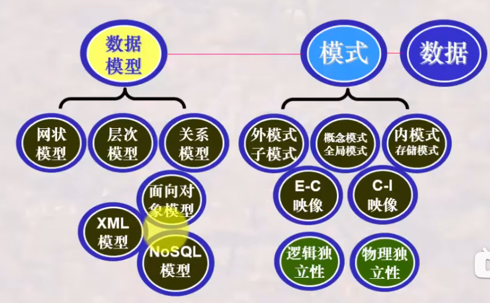

## 第3讲 关系模型之基本概念
### 关系模型的概述
关系模型的三要素：  
 * **基本结构**：Table  
 * **基本操作**：并、差、广义积、选择、投影、交、连接、除  
 * **完整性约束**：实体完整性、参照完整性、用户定义完整性  
 关系代数：基于集合的运算，是一次一集合的操作，是一种数学语言
 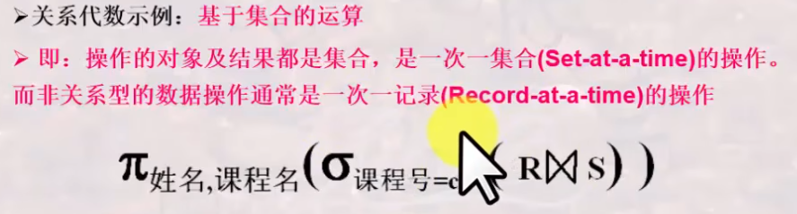  

关系运算 -> 关系数据库语言 -> DBMS的实现  
### 什么是关系
**"表"的严格定义**
* 首先定义 列 的取值范围 域(一组值的集合)，集合中元素的个数称为域的基数。
* 定义元组及所有可能组合成的元组：**笛卡尔积**(根据N个域形成的所有可能的n-元组的集合)。笛卡尔积的每个元素(d1,d2,...,dn)称为一个n-元组，每个值di叫做一个分量。
* 关系：一组域的笛卡尔积的子集(笛卡尔积中抽出来的有意义的组合)，此时列名(对关系当中这一列的含义取名)称为属性名。

关系模式是稳定的(结构)，而关系是某一时刻的值，是随时间可能发生变化的。  
**关系的特性**
* 列是同质：每一列中的分量来自同一域，是同一类型的数据（即每一列的数据类型必须相同）
* 不同列可来自同一个域：每一列为一个属性，不同的属性要给不同的属性名
* 列位置互换性、行位置互换性：区分列靠列名、区分行靠某一或几列的值(关键字)
* 理论上，关系的任意两个元组不能完全相同。(但Table不完全遵守这个特性)
* 属性不可再分特性：又称为关系第一范式，不能存在复合属性或属性再分的情况。

**关系中的概念**
* **候选码**：关系中的一个属性组，其值能**唯一标识**一个元组。(从该属性组中去掉任何一个属性都不再具有这个特性)这样的属性组称为候选码。有时关系中有很多组候选码。
* **主码(主键)**：从若干候选码中选定一个作为主码，DBMS以主码为主要线索管理关系中的元组。
* **主属性与非主属性**：包含在任何一个候选码中的属性称为主属性。
* **全码**：所有属性构成这个关系的候选码(最极端的情况)。
* **外码(外键)**：是关系R中的属性组但不是候选码，但其与另一个关系S的候选码相对应。两个关系之间通常靠外码连接。**外码是连接两个或多个关系的纽带**。

关系是严格的数学的定义，没有重复的原则，但表是可以的。
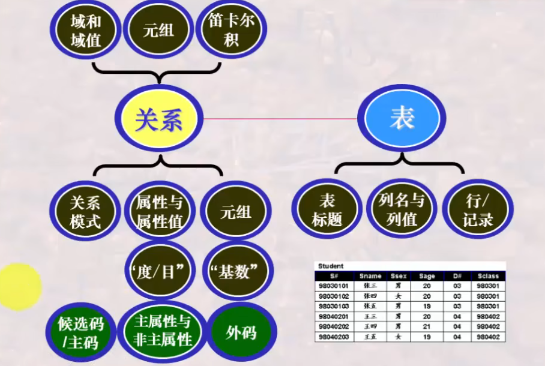  
### 关系模型中的完整性约束
**完整性约束规则**
* **实体完整性**：关系的主码中的属性值不能为空值(不知道或无意义的值)。
* **参照完整性**：外码可以为空值，但不为空值时必须为外表的主码(例如分配学生所在的系)。
* **用户自定义完整性**：用户针对具体的应用环境定义的完整性约束(例如年龄在多少之间\性别等)。此定义机制通常由DBMS提供使得用户可以自行定义、由DBMS检验操作的正确性。
### 总结
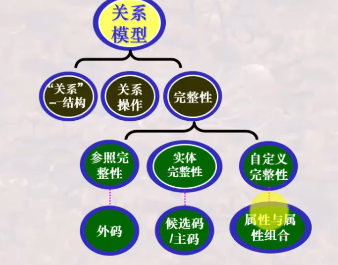
## 第4讲 关系模型之关系代数
### 关系代数之基本操作
**关系代数运算的特点**  
* 基于集合，提供了一系列的关系代数操作。
* 关系代数以一个或多个关系作为输入，结果是一个新的关系。
* 具有一定过程性，用对关系的运算来表达查询。
* 是一种抽象的语言，是学习其它数据库语言的基础。

**基本操作**  
  
* 并(*并相容) R∪S = S∪R：将两个关系的元组合并成一个关系，在合并时去重。用于查询XXX、XXX中至少参加了一个的信息。
* 差(*并相容) R-S / S-R：是...但不含...，用于查询只参加XXX而未参加XXX的信息。
* 广义笛卡尔积 R×S = S×R：关系R中的元组与关系S中的元组进行所有可能的组合拼接构成。拼接后元组数目相乘，度数相加。用于检索涉及多个表时串接的运算。是后续学习各种连接运算的基础。
* 选择 σcon(R)：从关系R中选择出满足给定条件condition的元组构成。  
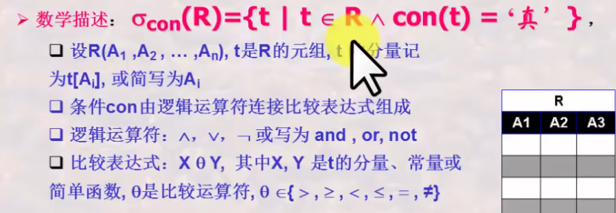
* 投影 ΠA(R)：从关系R中选出属性包含在A中的列构成，在合并时去重（因为对于关系来讲是集合，在实际运用时默认不去重）。

**关系代数运算的约束**  
* 某些操作，如并、差、交等，需满足并相容性 -> 关系R和关系S的属性数目相同，且第i个属性的域(domain, 在table中表现为type)相同

### 关系代数之扩展操作
**扩展操作**
* 交(*并相容) R∩S = S∩R = R-(R-S) = S-(S-R)：由同时出现在关系R和关系S中的元组构成，用于查询既参加XXX又参加XXX的信息。
* θ-连接(theta-join)：R与S的θ连接运算结果也是一个关系，记作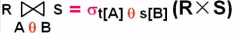。(可以理解为对笛卡尔积添加筛选条件)
* 更名 ρSC1(SC)：对表格进行更名以作为筛选条件的辅助操作。
* 等值连接(equi-join)：θ-连接的特殊情况，筛选条件中采用等值。
* 自然连接(natural-join)：等值连接的特殊情况，要求关系R和关系S必须有相同的属性组B。R,S属性相同，值必须相等才能连接。要在结果中去除重复的属性列。(实际上是最普遍使用的连接)
### 关系代数之组合与应用训练
练习章节，略过。主要要求根据表达特别注意语义和顺序。  
**书写关系代数表达式的基本思路**  
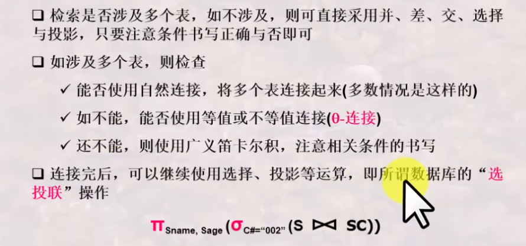  
### 关系代数之复杂扩展操作
### 总结
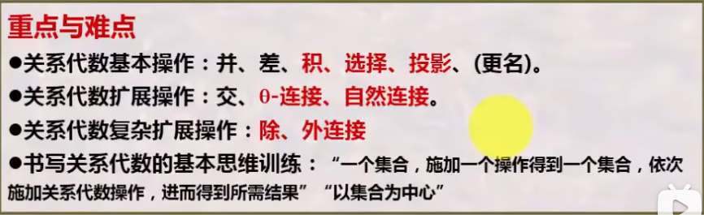  
**关系代数的基本书写思路**  
1. 选出将用到的关系/表
2. 做积运算(可用连接运算替换)
3. 做选择运算保留所需的行/元组
4. 做投影运算保留所需的列/属性