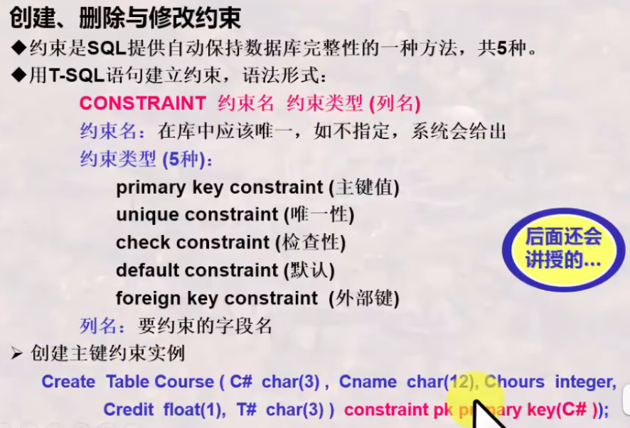
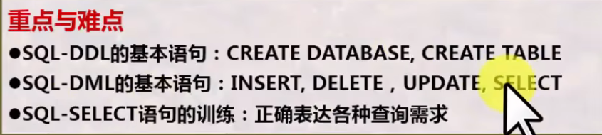
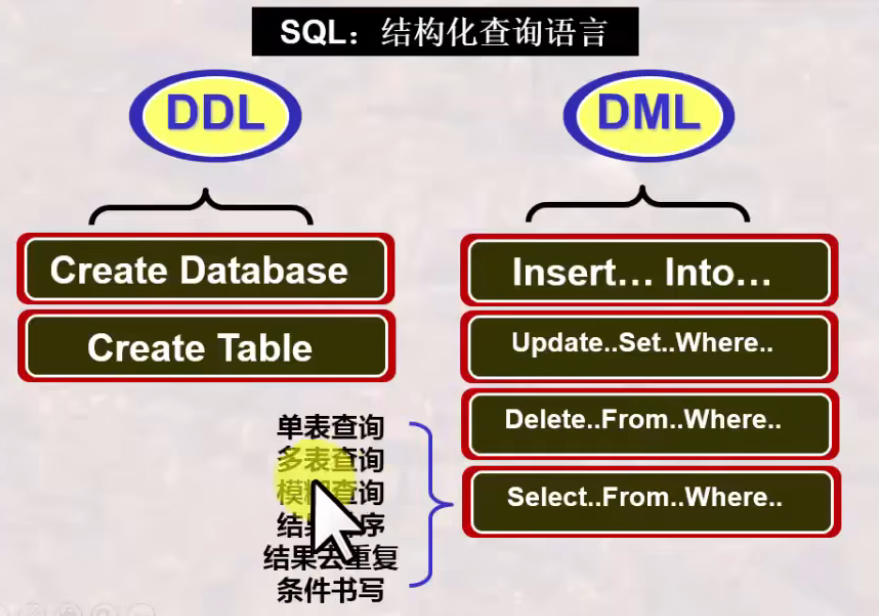
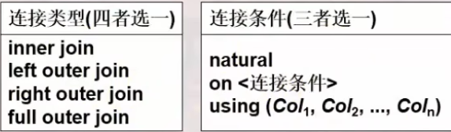
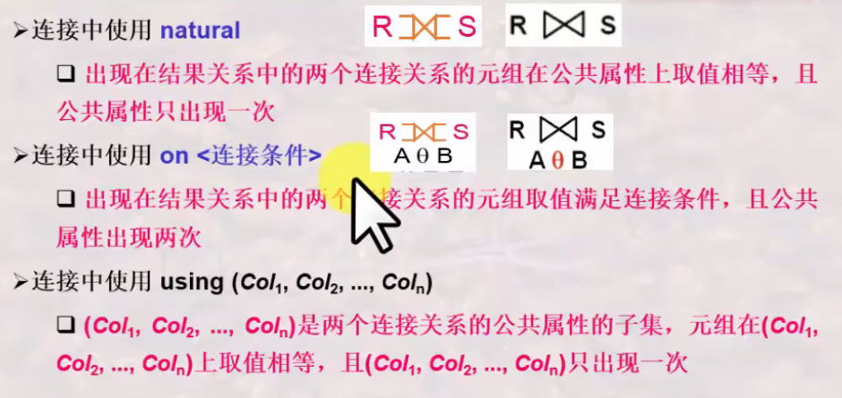
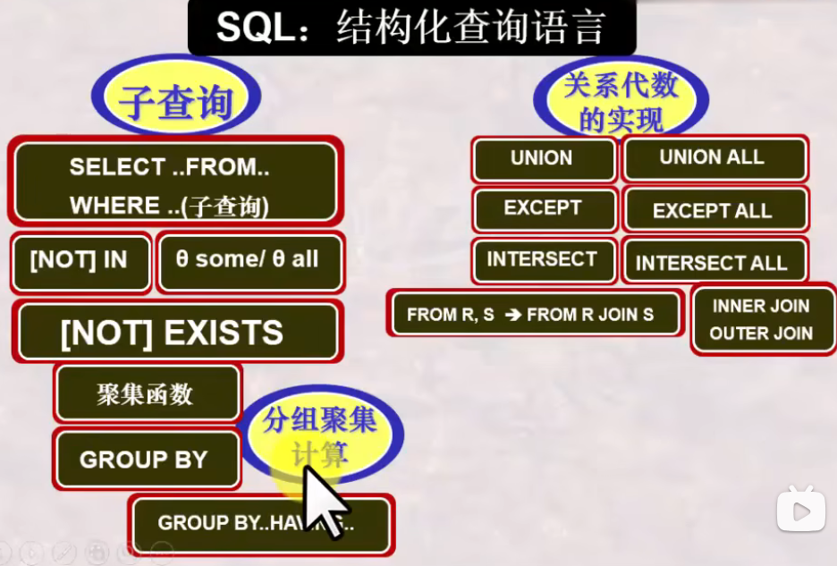
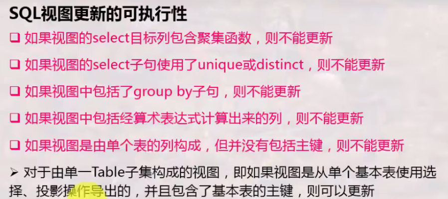
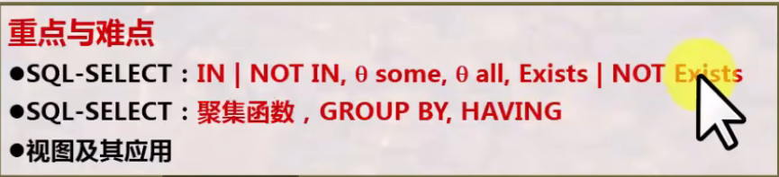
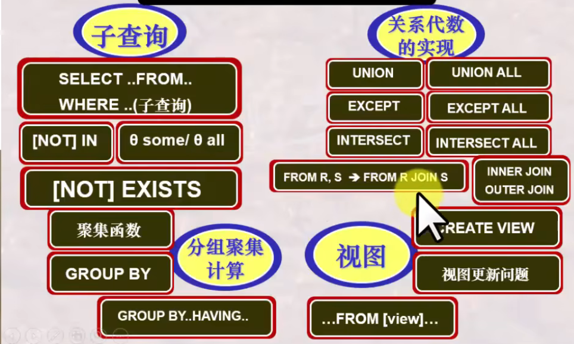

# 数据库系统 战德臣
## 第2讲 数据库系统的结构抽象与演变
### 数据与模式
**模式**: 对数据库中数据所进行的一种结构性的描述/所观察到的数据的结构信息, 是对视图的抽象。  
**视图/数据**: 某一种表现形式下表现出来的数据库中的数据。  
**数据库的标准结构**: 三级模式、两层映像  
#### 三级模式
 * **外模式**:  对用户所看到的局部的数据的一种描述。  
 * **概念模式**: 数据之间内在的本质的联系（全局性的）。  
 * **内模式（物理模式）**: 存储在介质上的数据的结构描述。  
#### 两层映像
 * **E-C映像**: 外模式映射为概念模式的映像, 实现转换, 便于用户观察和使用。  
 * **C-I映像**: 概念模式映射为内模式的映像, 便于计算机存储和数据的处理。  
#### 两个独立性（三级模式、两层映像所实现）
避免应用程序在开发时不断修改  
 * **逻辑数据独立性**: 概念模式变化时, 可以不改变外部模式（只改变E-C Mapping）, 从而无需改变应用程序。  
 * **物理数据独立性**: 内部模式变化时, 可以不改变概念模式（只改变C-I Mapping）, 从而不改变外部模式。  
### 数据模型
**数据模型**: 规定模式统一描述方式的模型, 包括: 数据结构、操作和约束, 是对模式本身结构的抽象（而模式是对数据本身结构形式的抽象）。  
**ep. 关系模型**: 所有模式都可为抽象表的形式\[数据结构\], 而每一个具体的模式都是拥有不同列名的具体的表。对这些表形式的数据有哪些\[操作\]和\[约束\]。  
**ep. 理解**: 模式指代一定数据结构组成的抽象表（是对于数据的结构的抽象）, 数据模型则定义了其统一描述的方式（是对模式的结构的抽象）。  
  
#### 三大经典数据模型
 * 关系模型: 表的形式组织数据（传统模式）
 
 * 层次模型: 树的形式组织数据（实体型-系型,即节点-线, 以指针指向记录）
   
 PS: 模式可以理解为表头?
 * 网状模型: 图的形式组织数据（实体型-系型,即节点-线, 与层次模型类似, 如今使用不多）
   
 PS: 网状模型中指针需要用户建立。
### 发展史 30:00
#### 数据库技术的简要发展史
 * 数据库技术探索阶段(59-65/67): 正式提出Database概念
 * 数据库技术确立阶段(65/68-75): 研究形成关系数据库理论基础, 开始商用
 * 数据库技术成熟阶段(76-80s前期): 提出标准化数据库系统结构模型, 关系理论日益完善, 应用普及
 * 数据库技术深化发展阶段(85年以来): 数据库方法逐步理论化, 设计理论不断完善, 出现面向各行各业的专用数据库
#### 演变与发展
 1. 文件系统（存储基本以记录为单位, 用户无需考虑存储的物理细节。但数据与程序紧密结合, 共享性差、冗余度大）
 2. 层次、网状模型数据库（DBMS调用操作系统的函数对数据库存储和处理, 整体数据结构化, 多个应用程序可共享数据及数据结构的操作, 方便了应用程序的编写和使用。数据共享程度高、数据冗余度小、有统一的数据控制功能。但数据之间由复杂的指针系统维系, 结构描述复杂, 不能有效支持记录集合的操作）
 3. 关系模型数据库（不需要用户建立指针, 结构表征简单: 由属性的值表征, 不依赖于路径信息或过程信息, 支持非过程化的数据操作, 有效支持记录集合的操作。但必须按行列组织数据即1NF, 数据项不可再分）
 4. 对象关系数据库、面向对象数据库（引入了对象概念 - 行对象和列对象: 聚集对象与结构对象, 有效支持不满足1NF的数据项, 支持面向对象的特性: 类、继承、封装、多态）
 * XML数据库: 数据库的另一种形式, 被称为半结构化数据库, 封装在文件当中。数据与数据的语义合并在一起进行存储和处理。（类似HTML）
 * 由多种多样的数据库到多数据库（ODBC\JDBC | Oracle\Java）开放式互连。
 * 由普通数据库到与各种先进技术结合所形成的新型数据库。
### 总结

## 第3讲 关系模型之基本概念
### 关系模型的概述
关系模型的三要素:   
 * **基本结构**: Table  
 * **基本操作**: 并、差、广义积、选择、投影、交、连接、除  
 * **完整性约束**: 实体完整性、参照完整性、用户定义完整性  
 关系代数: 基于集合的运算, 是一次一集合的操作, 是一种数学语言
   

关系运算 -> 关系数据库语言 -> DBMS的实现  
### 什么是关系
**"表"的严格定义**
* 首先定义 列 的取值范围 域(一组值的集合), 集合中元素的个数称为域的基数。
* 定义元组及所有可能组合成的元组: **笛卡尔积**(根据N个域形成的所有可能的n-元组的集合)。笛卡尔积的每个元素(d1,d2,...,dn)称为一个n-元组, 每个值di叫做一个分量。
* 关系: 一组域的笛卡尔积的子集(笛卡尔积中抽出来的有意义的组合), 此时列名(对关系当中这一列的含义取名)称为属性名。

关系模式是稳定的(结构), 而关系是某一时刻的值, 是随时间可能发生变化的。  
**关系的特性**
* 列是同质: 每一列中的分量来自同一域, 是同一类型的数据（即每一列的数据类型必须相同）
* 不同列可来自同一个域: 每一列为一个属性, 不同的属性要给不同的属性名
* 列位置互换性、行位置互换性: 区分列靠列名、区分行靠某一或几列的值(关键字)
* 理论上, 关系的任意两个元组不能完全相同。(但Table不完全遵守这个特性)
* 属性不可再分特性: 又称为关系第一范式, 不能存在复合属性或属性再分的情况。

**关系中的概念**
* **候选码**: 关系中的一个属性组, 其值能**唯一标识**一个元组。(从该属性组中去掉任何一个属性都不再具有这个特性)这样的属性组称为候选码。有时关系中有很多组候选码。
* **主码(主键)**: 从若干候选码中选定一个作为主码, DBMS以主码为主要线索管理关系中的元组。
* **主属性与非主属性**: 包含在任何一个候选码中的属性称为主属性。
* **全码**: 所有属性构成这个关系的候选码(最极端的情况)。
* **外码(外键)**: 是关系R中的属性组但不是候选码, 但其与另一个关系S的候选码相对应。两个关系之间通常靠外码连接。**外码是连接两个或多个关系的纽带**。

关系是严格的数学的定义, 没有重复的原则, 但表是可以的。
  
### 关系模型中的完整性约束
**完整性约束规则**
* **实体完整性**: 关系的主码中的属性值不能为空值(不知道或无意义的值)。
* **参照完整性**: 外码可以为空值, 但不为空值时必须为外表的主码(例如分配学生所在的系)。
* **用户自定义完整性**: 用户针对具体的应用环境定义的完整性约束(例如年龄在多少之间\性别等)。此定义机制通常由DBMS提供使得用户可以自行定义、由DBMS检验操作的正确性。
### 总结

## 第4讲 关系模型之关系代数
### 关系代数之基本操作
**关系代数运算的特点**  
* 基于集合, 提供了一系列的关系代数操作。
* 关系代数以一个或多个关系作为输入, 结果是一个新的关系。
* 具有一定过程性, 用对关系的运算来表达查询。
* 是一种抽象的语言, 是学习其它数据库语言的基础。

**基本操作**  
  
* 并(*并相容) R∪S = S∪R: 将两个关系的元组合并成一个关系, 在合并时去重。用于查询XXX、XXX中至少参加了一个的信息。
* 差(*并相容) R-S / S-R: 是...但不含..., 用于查询只参加XXX而未参加XXX的信息。
* 广义笛卡尔积 R×S = S×R: 关系R中的元组与关系S中的元组进行所有可能的组合拼接构成。拼接后元组数目相乘, 度数相加。用于检索涉及多个表时串接的运算。是后续学习各种连接运算的基础。
* 选择 σcon(R): 从关系R中选择出满足给定条件condition的元组构成。  

* 投影 ΠA(R): 从关系R中选出属性包含在A中的列构成, 在合并时去重（因为对于关系来讲是集合, 在实际运用时默认不去重）。

**关系代数运算的约束**  
* 某些操作, 如并、差、交等, 需满足并相容性 -> 关系R和关系S的属性数目相同, 且第i个属性的域(domain, 在table中表现为type)相同

### 关系代数之扩展操作
**扩展操作**
* 交(*并相容) R∩S = S∩R = R-(R-S) = S-(S-R): 由同时出现在关系R和关系S中的元组构成, 用于查询既参加XXX又参加XXX的信息。
* θ-连接(theta-join): R与S的θ连接运算结果也是一个关系, 记作。(可以理解为对笛卡尔积添加筛选条件)
* 更名 ρSC1(SC): 对表格进行更名以作为筛选条件的辅助操作。
* 等值连接(equi-join): θ-连接的特殊情况, 筛选条件中采用等值。
* 自然连接(natural-join): 等值连接的特殊情况, 要求关系R和关系S必须有相同的属性组B。R,S属性相同, 值必须相等才能连接。要在结果中去除重复的属性列。(实际上是最普遍使用的连接)
### 关系代数之组合与应用训练
练习章节, 略过。主要要求根据表达特别注意语义和顺序。  
**书写关系代数表达式的基本思路**  
  
### 关系代数之复杂扩展操作
 * 除 R÷S: 查询...全部的/所有的..., 要求除属性集S是被除属性集R的真子集。结果的度数k=n-m。  
   验证方法: (R÷S)×S的元组都在R的元组中。  
   ep: 查询选修了全部课程的学生的学号。
 * 外连接(outer-join): 与θ-连接相比, 连接时不会丢失元素(失配信息记为空值)。又进一步细分为左外连接、右外连接、全外连接。
### 总结
  
**关系代数的基本书写思路**  
1. 选出将用到的关系/表
2. 做积运算(可用连接运算替换)
3. 做选择运算保留所需的行/元组
4. 做投影运算保留所需的列/属性

**章节回顾**  
  

## 第5讲 关系模型之关系演算
### 关系演算之关系元组演算
按照谓词变量的不同, 可分为**关系元组演算**(以元组变量作为谓词变量的基本对象)和**关系域演算**(域变量)  
基本形式: {t|P(t)} 表示所有使谓词P为真的元组t的集合  

  
注意运算符优先次序(括弧;θ;全称量词;取反;and;or)导致的结果差异！
* 被存在量词或全称量词限定的元组变量被称为**约束变量**, 否则被称为**自由变量**。
* **存在量词**: 全假则假, 一真则真; **全称量词**: 全真则真, 一假则假  

**这一段的训练题非常多, 涉及到离散数学/概率论中的逻辑。可以看原视频深入了解。**  
**四个最复杂的例子**
1. "全都学过": 视频44:09
  
2. "全没学过": 视频49:32
  
3. "至少有一学过" 视频52:40
  
4. "至少有一没学过" 视频53:50
  

元组演算公式与关系代数的等价性  
  

### 关系演算之关系域演算
1. **关系域演算公式**  
  基本形式: {<x1,x2,...,xn>|P(x1,x2,...,xn)}  
  其中xi代表域变量或常量, P为以xi为变量的公式
2. **构造示例**  
  
3. **基于关系域演算的QBE语言**
  * 特点: 操作独特, 基于屏幕表格的查询语言, 只需将条件填在表格中
  * 是一种高度非过程化的查询语言
  * 适合终端用户的使用
  * 操作框架由四个部分构成: 关系名区, 属性名区, 操作命令区, 查询条件区
  * 操作命令: P.(Print), D.(Delete), I.(Insert), U.(Update)
  * 查询条件形式为 θ 参量(省略θ则默认为=)
  * 示例元素与投影: 
    * 用任何一个值带有下划线表示, 被称为示例元素
    * 只用于占位(通过表格反映查询条件)
    * 符号也可写在操作区, 表示对整行生效
    * 可利用同一连接条件使用相同的示例元素, 实现多个表的连接  
  * PS: 视频1:23:00有误, 满足例子条件的应该放在同一行。视频中的表格实现的是年龄大于19岁或男同学。  
### 关系演算之安全性
**不产生无限关系和无穷验证的运算被称为是安全的**
 * 关系代数是一种集合运算, 是安全的(集合本身是有限的)
 * 关系演算不一定是安全的(R(t)是有限的, 但不在R(t)中的元素可能是无限的)
 
所以需要对关系演算施加约束条件, 即**安全约束有限集合DOM**: 其为一个有限集合, 其中的每个符号要么是公式中明显出现的符号, 要么是出现在公式中的某个关系R的某元组的分量。  
**安全元组演算表达式**  
  
**安全域演算表达式**  
同理。课程视频中未介绍。
### 关于三种关系运算的观点
 * 关系运算有三种: 关系代数、关系元组演算和关系域演算
 * 三种关系运算都是抽象的数学运算, 体现了三种不同思维(以元组、集合、域变量为对象)
 * 三种运算之间是(有条件: 即安全的元组/域演算表达式)等价的
 * 三种运算都可以说是非过程性的: 域演算>元组演算>关系代数
 * 三种关系运算虽然是抽象的, 但是是衡量数据库语言完备性的基础
 * 数据库语言可以基于这三种抽象运算来设计
### 总结
  
本讲主要是基于逻辑的思维, 讨论从关系演算->元组演算/域演算, 涉及到与、或、非、存在量词、全称量词。  
## 第6讲 SQL语言之概述
### SQL语言概述
**SQL语言的发展历史**
 * 1974年由Boyce和Chamber提出
 * 1975-1979年由San Jose研究室在System R首次实现, 称为Sequel -> SQL
 * 1986年ANSI/ISO推出SQL-86标准
 * 1989年ANSI/ISO推出SQL-89标准
 * 1992年进一步提出SQL标准: SQL-92, 也称SQL2(标准关系数据库语言)
 * 1999年进一步提出SQL标准: SQL-99, 也称SQL3(面向对象数据库/对象关系数据库)
 * SQL 2003/2006/2008(对数据库应用程序进行规范)
 * 另有SQL X/Open标准, 强调各厂商产品的可移植性, 只包含被各厂商广泛认可的操作 -> 标准使得用户可以学习标准规定的语言, 而无需关注具体的软件产品(具体应用依然略有差异)

**SQL语言的功能概述**
 * SQL语言是集DDL、DML、DCL于一体的数据库语言
 * SQL语言主要由9个单词引导的操作语句构成: 
   * **DDL**: Create, Alter, Drop - 模式的定义和删除
   * **DML**: Insert, Delete, Update, Select - 各种方式的更新与检索操作
   * **DCL**: Grant, Revoke - 安全性控制
 * 课程逐步递进: 交互式SQL -> 嵌入式SQL -> 动态SQL
 * **课程要求: 理解查询(增删改查)需求、用SQL精确表达**
### SQL语言之DDL-定义数据库
**建立数据库**: 包括 定义数据库和表(使用DDL), 向表中追加元组(使用DML)  
**创建数据库的简单语法形式**: create database 数据库名;  
**创建Table的简单语法形式**: create table 表名( 列名 数据类型 \[Primary key|Unique\] \[Not null\] \[,列名 数据类型 \[Not null\],...\])  
 * Primary key: 主键约束, 每张表只能创建一个。
 * Unique: 唯一性约束(即候选键), 每张表可以有多个。
 * Not null: 非空约束, 指该列不允许有空值出现。
 * 语法中的数据类型在SQL-92标准中被定义。
   * char(n): 固定长度字符串
   * varchar(n): 可变长度字符串
   * int: 整数, 有时不同系统为integer
   * numeric(p,q): 固定精度数字, 小数点左边p位,  右边p-q位
   * real: 浮点精度数字, 有时不同系统为float(n)
   * date: 日期 (ep. 2003-09-12)
   * time: 时间 (ep. 23:15:15:003)
* 和高级语言的数据类型总体一致, 但也有些差异

**向表中追加元组的简单语法形式**: insert into 表名\[(列名\[,列名\]...)\] values (值 \[,值\], ...);
 * 若列名未省略, 需与语句中列名的顺序一致; 若省略, 需与定义的列名顺序一致

**修正数据库**: alter table 表名 \[add {列名 数据类型,...}\] \[drop {完整性约束名}\] \[modify {列名 数据类型,...\]
 * add: 增加新列, drop: 删除完整性约束, modify: 修改列定义
 * **注意: 现在一般不再使用modify, 转而使用column修改。视频使用的SQL版本较老, 现今可能有部分语法更新, 以最新语法为准**  

**撤销基本表**: drop table 表名;  
**撤销数据库**: drop database 数据库名;  
有些数据库有操作多个数据库的能力, 对此可以以以下命令做切换:  
**指定当前数据库**: use 数据库名;  
**关闭当前数据库**: close 数据库名;  
### SQL语言之DML-操纵数据库
**检索语句的简单语法形式**: select 列名\[\[,列名\]...\] from 表名 \[where 检索条件\];
 * 在检索结果中可能有重复元组, 若要求无重复则需使用DISTINCT保留字。
 * 结果排序: order by 列名 \[asc|desc\] - asc或省略为升序, desc为降序
 * 模糊查询: 列名\[not\] like "字符串"
   * % 匹配零个或多个字符
   * _ 匹配任意单个字符
   * \\ 转义字符

**检索语句的多表联合查询**: select 列名 \[\[,列名\]...\] from 表名1,表名2,... where 检索条件;
 * 检索条件要包含连接的条件
 * 如两个表的属性名相同, 则需采用**表名.属性名**的方式来限定该属性名属于哪一张表
 * 如有表格重名/列名特别长的情况, 则需要用as设定别名以便区分(PS: 实际上在SQL中可以不添加as, 直接在空格后设定别名)

**增、删、改、查**
 * Insert: insert into 表名 (属性名\[, 属性名, ...\]) (值\[, 值, ...\])
 * Insert内可以嵌套Select语句
 * Delete: delete from 表名 \[where 条件表达式\]
 * 不添加条件表达式则会删除表中所有元组
 * Update: update 表名 set 列名=表达式 | (子查询) \[\[,列名=表达式|(子查询)\]\] \[where 条件表达式\];
 * 不添加where条件则会更新表中所有元组

**创建表(T-SQL语句)**: create table \[数据库名.所有者名.\]表名 ({<列名 数据类型>} \[缺省值\]\[约束\]\[是否为空\]);  
**创建、删除、修改约束: 在第9讲中详细介绍**  
  
### 典型DBMS交互环境 SQL Server介绍
SQL Server是Microsoft提供的一款关系数据库管理系统。
**系统数据库(SQL Server自带,自动安装)**
 * Master: 存储SQL Server中的元数据
 * Model: 模板数据库, 在创建新数据库时会复制此数据库作为基础
 * Msdb: 代理服务数据库
 * Tempdb: 临时数据库, 为临时数据提供存储空间

**SQL Server数据库**
 * 文件: 三种扩展名: 主数据库文件.mdf/辅助数据库文件.ndf/日志.ldf - 启动信息/所定义数据库的其它数据/事务日志文件
 * 页面: SQL Server存储的最小单位, 一页为8KB
 * 空间: 8个连续的页面即64KB数据, 是分配数据表存储空间的一种单位

**数据库授权**: grant 权限 on 表名 to 用户名  
 * 权限: select, update, insert, delete, exec, dri
### 总结
  
  
## 第7讲 SQL语言之复杂查询与视图
### 子查询运用
**为什么需要子查询**
 * 集合成员资格判断
 * 集合之间的比较
 * 集合基数的测试(是否为空, 是否存在重复元组)

**(NOT) IN子查询**
 * 基本语法: 表达式 \[not\] in (子查询)
 * 语义: 判断某一表达式的值是否在子查询的结果中。

 * 带有子查询的selcet语句区分为内层和外层
 * 非相关子查询: 内层查询独立进行, 没有涉及任何外层查询相关信息的子查询
 * 相关子查询: 内层查询需要依靠外层查询的某些参量作为限定条件才能进行的子查询, 外层向内层传递的参量需要使用外层的表名或表别名来限定
   * (只能由外层向内层传递参数, 而不能反之, 也称为变量的作用域原则)

**θ Some与θ All子查询**
 * 基本语法: 表达式 θ some/all(子查询) - θ是比较运算符
 * 语义: 将表达式的值与子查询的结果进行比较
 * 曾经有θany, 之后由于容易引起歧义, 改为了θsome
 * in 和 = some 等价, not in 和 <> all等价

**(NOT) EXISTS子查询**
 * 基本语法: \[not\] exists (子查询)
 * 语义: 子查询结果中有无元组存在

### 结果计算与聚集函数
**结果计算**
 * select子句后面可以是一些计算表达式或聚集函数, 表明在投影的同时进行计算
 * 内置的聚集函数: count(); sum(); avg(); max(); min()

### 分组查询与分组过滤
**分组查询与过滤**
 * 将检索到的元组按照某一条件进行分类, 同时处理多个组或集合的聚集运算
 * 基本语法: select ... from ... \[where ...\] group by 分组条件 \[having 过滤条件\]
 * 聚集函数不允许用于where语句中! 

### 利用SQL语言实现关系代数操作
**并-交-差处理**
 * 基本语法: 子查询 {Union \[ALL\] | Intersect \[ALL\] | Except \[ALL\] 子查询}
 * 不带ALL则默认自动删除重复元组, 若要保留则需要带有ALL
 * 交运算符intersect并没有增强sql的表达能力, 只是其增加了sql语言的不唯一性
 * 这些运算都在SQL-99中, 但有些DBMS不支持这些运算, 要注意。

**空值的处理**
 * 空值检测语法: is \[not\] null - 测试指定列的值是否为空值
 * 现行DBMS的空值处理
   * 除了is \[not\] null外不满足任何查找条件
   * 若参与算术运算, 则该算术表达式的值为null
   * 若参与比较运算, 则结果视为false
   * 若参与聚集运算, 则除了count(*)之外都忽略null

**内连接、外连接**
 * 基本语法: select 列名 from 表名1 \[NATURAL\] \[INNER|{LEFT|RIGHT|FULL}\[OUTER\]\] JOIN 表名2
 * 连接类型和连接条件  
   
 

**部分总结**  

### 视图及其应用
 * 视图在SQL中只存储其由基本表导出视图所需要的公式, 其数据并不存储, 而是在运行过程中动态产生与维护的
 * 对视图数据的更改最终要反映在对基本表的更改上, 而有时视图定义的映射不可逆, 故视图的更新是比较复杂的问题
 * 定义视图: create view 视图名 \[(列名\[, 列名\] ...)\] as 子查询 \[with check option\]
 * 若属性名缺省, 则默认为子查询结果中的属性名
 * with check option指明当视图进行增改删时, 要检查是否满足视图定义中子查询中定义的条件表达式
 
 **SQL视图更新的可执行性**  
 

 * 撤销视图: drop view 视图名
### 总结

## 第8讲 SQL语言与数据库完整性和安全性
### 数据库完整性的概念及分类
**概念**
 * 数据库完整性指的是DBMS应保证的DB的一种特性——在任何情况下的正确性、有效性和一致性
 * 广义: 语义完整性、并发控制、安全空值、DB故障恢复
 * 狭义: 专指**语义完整性**, DBMS通常有专门的完整性管理机制与程序来处理语义完整性问题（本讲专指此）
 * 不正当的数据库操作引发数据库完整性问题

**数据库完整性管理的作用**
 * 防止和避免数据库中不合理数据的出现
 * DBMS应尽可能地自动防止DB中语义不合理现象的出现

**怎样保证完整性**
 * 允许用户(DBA)定义一些完整性约束规则
 * 当有DB更新操作时, DBMS自动按照完整性约束条件进行检查以确保更新操作符合语义完整性

**完整性规则 ::=(O,P,A,R)**
 * O: 数据集合: 约束的对象
 * P: 谓词条件: 什么样的约束
 * A: 触发条件: 什么时候检查
 * R: 响应动作: 不满足时怎么办

**完整性的分类**
 * 按约束对象分类
   * 域完整性约束条件: 施加于某一列上（仅涉及到一列）
   * 关系完整性约束条件: 施加于关系/table上（可能涉及到多列）
 * 按约束来源分类
   * 结构约束: 来自模型的约束, 例如函数依赖约束、主键约束、外键约束
   * 内容约束: 来自用户的约束, 例如用户自定义完整性
 * 按约束状态分类
   * 静态约束: DB在任一时候均应满足的约束
   * 动态约束: 要求DB从一状态变为另一状态时应满足的约束

### SQL语言之列约束与表约束——静态约束
**SQL语言支持的约束类别**
 * 静态约束: 列完整性、表完整性
 * 动态约束: 触发器

**实现约束的方法——Create Table**
 * 表约束通过逗号区分开这一列, 列约束则是随每一列而定义
 * Col_constr列约束  
 
 * table_constr表约束  
 
 * 撤销/追加约束（不同系统可能有差异）
 

**实现约束的方法——断言**
 * 就是一个谓词表达式, 表达了希望数据库总能表达的体哦阿健
 * 表约束和列约束就是特殊的断言
 * SQL还提供了复杂条件表达的断言: CREATE ASSERTION <断言名> CHECK <条件>
 * 断言测试会增加数据库维护的负担, 要小心使用复杂的断言
### SQL语言之触发器——动态约束
 * trigger是一种过程完整性约束, 可以在特定的时刻被自动触发执行
 * 基本语法  
 

 * 新旧值用old_row_corr_name/new_row_corr_name/old_table_corr_name/new_table_corr_name区分
 * referencing new x, old y
### 阶段性总结

### 数据库安全性的概念及分类
 * 概念: 数据库安全性是DBMS应该保证的数据库的一种特性: 免受非法、非授权用户的使用、泄漏、更改、破坏
 
**DBMS的安全机制**
 * 自主安全性控制: 存取控制: 通过权限在用户之间的传递使得用户自主管理数据库安全性
 * 强制安全性控制: 通过对数据和用户强制分类, 使得不同类别用户能访问不同类别的数据
 * 推断控制机制: 防止通过历史信息推断出不该被其知道的信息；防止通过一些信息推断出私密信息
 * 数据加密存储机制: 通过加密、解密保护数据

**DBA的责任和义务**
 * 划分好数据的安全级别以及用户的安全级别, 实施安全性控制

**数据库自主安全性机制的实现**
 * DBMS允许用户定义一些安全性控制规则(用SQL-DCL定义)
 * 安全性访问规则: AccessRule ::=(S,O,t,P)
   * S: 请求主体（用户）
   * O: 访问对象
   * t: 访问权利
   * P: 谓词
 * AccessRule通常存放在数据字典或系统目录中, 构成了所有用户对DB的访问权利
 * 用户多时, 可以按用户组建立访问规则

  

 * 亦可使用视图(view)进行安全性控制
 * 用户定义视图后，其便成为一个新的数据对象，参与到存储矩阵与能力表中描述
### SQL语言之安全性实现
**SQL语言的用户与权利**  

**SQL-DCL的命令及其应用**  
  
 * 授予视图权利不代表授予基本表权利
 * 授权者授予的权利必须是授权者已有的权利

(public为授权给所有用户)  

**授权的传播范围**  
  
 * 当一个用户的权利被收回时, 通过其传播给其它用户的权利也将被收回

**强制安全性机制**
 * 通过对数据对象进行安全性分级: Top Secret/Secret/Confidential/Unclassified
 * 同时对用户也进行上述的安全性分级
 * 强制实现不同级别用户访问不同级别数据的一种机制
 * 但是高级别用户不允许写低级别数据
 * DBMS引入强制安全性机制, 可以通过扩展关系模式来实现, 使得关系中的每个元组扩展为带有安全分级的元组
### 阶段性总结

### 总结
