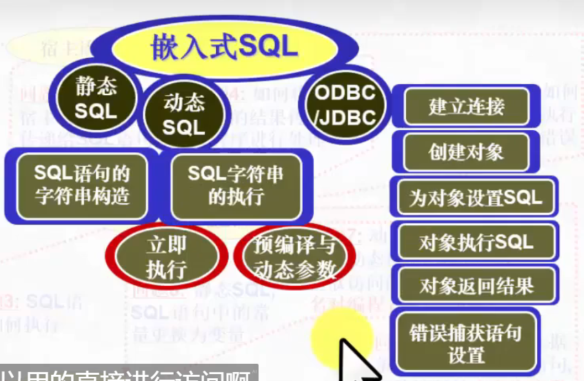

# 数据库系统 战德辰
## 第10讲 嵌入式SQL语言之动态SQL
### 动态SQL的概念和作用
 * 静态SQL: SQL语句在程序中已经按要求写好, 只需要把一些参数通过变量传递给嵌入式SQL语句
 * 动态SQL: SQL语句可以在程序中动态构造, 形成一个字符串再交给DBMS执行
### SQL语句的动态构造
### 动态SQL语句的执行方式
 * 立即执行语句: 运行时编译并执行
 * Prepaer-Execute-Using: 先编译, 编译后的SQL语句允许动态参数, 用USING语句将动态参数值传送给编译好的语句
### 数据字典与SQLDA
 * 数据字典(系统目录): 是系统维护的一些表或视图的集合, 存储了数据库中各类对象的定义信息, 这些信息又称为数据的元数据
   * 包含与关系相关的信息
   * 包含用户与账户信息, 包括密码
   * 统计与描述性数据
   * 物理文件组织信息
   * 索引相关的信息
 * 数据字典也是存储在磁盘上的关系, 但是专为内存高效访问而设计的特定的数据结构
 * 模式是指某一用户所设计和使用的表、索引及其它与数据库有关的对象的集合, 完整名应是: 模式名.表名
 
 * SQLDA: SQL描述符区域, 是一个内存数据结构, 装载关系模式的定义信息
### ODBC/JDBC简介
 * ODBC是一种标准————不同语言的应用程序与不同数据库服务器之间通讯的标准
 * 当应用程序调用ODBC API时, ODBC API会调用具体DBMS Driver库函数, 库函数则与数据库服务器进行通讯, 执行相应请求并返回结果
   * 应用程序通过SQLExecDirect()向数据库发送SQL命令
   * 使用SQLFetch()获取产生的结果元组
   * 使用SQLBindCol()绑定C语言变量与结果中的属性
 * JDBC是Java版的应用程序接口API, 提供了Java应用程序与数据库服务器的连接和通讯能力
 * JDBC分成两个程序包: Java.sql 核心API/Javax.sql 可选扩展API
 ---
 * 嵌入式SQL的思维模式: 建立数据库连接->声明一个游标->打开游标->获取一条记录->关闭游标->断开数据库连接
### 总结

