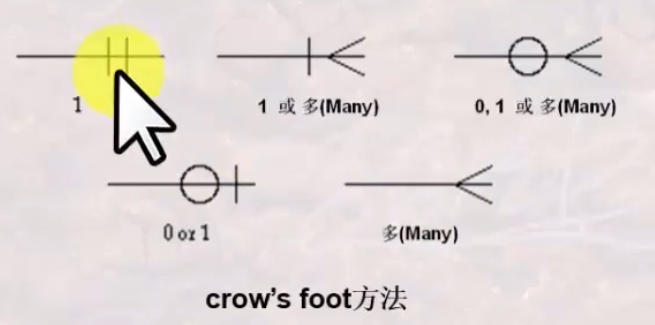
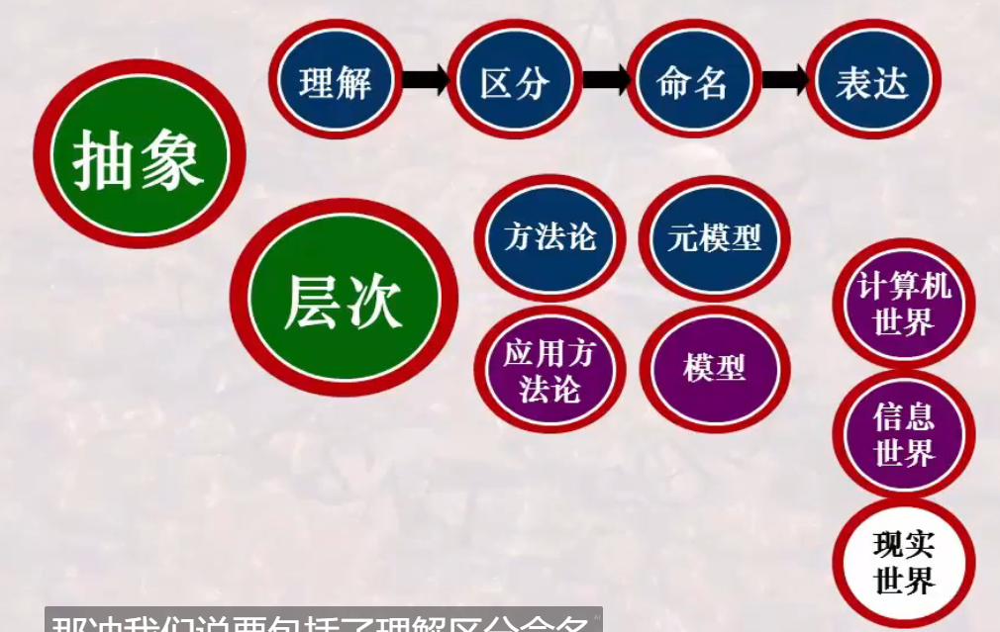
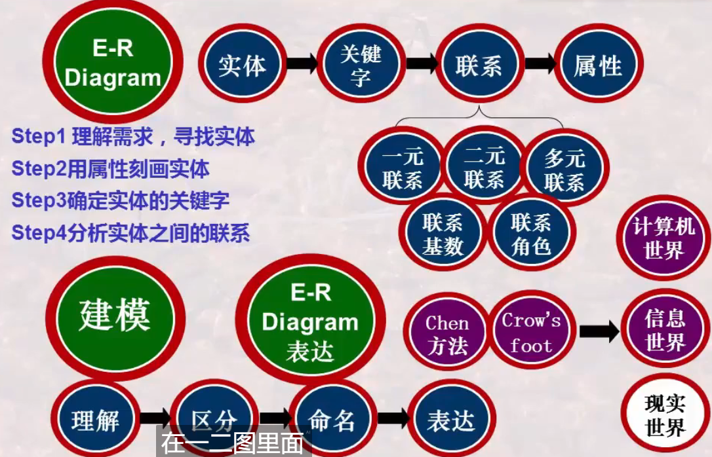

# 数据库系统 战德辰
## 第11讲 数据建模: 思想与方法(数据库设计的抽象与表达方法)
### 为什么要数据建模和数据库设计
 * 需求的理解和表达是很重要的
 * 表达计算机世界的模型称数据模型; 表达信息世界的模型称概念数据模型, 简称概念模型
 * 信息世界是对现实世界的理解与抽象
 * 数据建模 -> 数据库设计
 * 数据建模是抽象, 抽象是理解-区分-命名-表达
### ER模型-数据建模之基本思想
 * Entity-Relationship Model 实体联系模型
 * 基本观点: 世界是由一组称作实体的基本对象和这些对象之间的联系构成的
 * 基本概念: 实体、属性、联系、关键字/码
 ---
 * 实体: 客观存在并可相互区分的事务
 * 实体有类(实体, 实体的型)和个体(实体的实例, 实体的值)的概念
 * 实体用属性来刻画: 属性是实体所具有的某一方面的特性
    * 属性分为单一属性和复合属性, 在关系模型中复合属性一定要转化为单一属性(1NF)
    * 属性还分为单值属性和多值属性, 比如一个人可能有多个电话号码。在关系模型中同样需要转化为单值属性。
    * 属性分为可空值属性和非空值属性
    * 属性分为原始属性和导出属性(由其它属性计算而得的)
 * 实体中的特殊属性: 关键字/码, 实体中能用其值唯一区分开每一实例的属性或属性组合
 * 实体之间是有联系的: 指一个实体的实例和其它实体实例之间所可能发生的联系
 * 参与发生联系的实体的数目, 称为联系的度或元。联系有一元联系、二元联系和多元联系 | 实体是相对稳定的, 但联系是多样化的
 * 角色: 实体在联系中的作用称为实体的角色。显式指明其角色以在同一实体的不同实例参与一个联系时区分各实例参与联系的方式
 * 实体之间的二元联系有一对一、一对多、多对多的联系
 * 联系的基数: 实体实例之间的联系的数量, 即一个实体的实例通过一个联系能与另一实体中相关联的实例的数目(关系到怎么保存)
 * 联系的基数还要区分对每个实体的实例而言是否必须存在(完全参与联系: 最小基数1开始/部分参与联系: 最小基数0开始)(关系到空值的处理)
### ER模型-表达方法之Chen方法
 * 实体: 矩形框
 * 属性: 椭圆(用于刻画实体的)
   * 多值属性: 双线椭圆
   * 导出属性: 虚线椭圆
 * 关键字/码: 下划线
 * 连接实体和属性: 直线
 * 联系: 菱形框
 * 连接实体与联系: 直线
 * 连接联系与属性: 直线
 * 复合关键字: 标有相同数字
 * 多组关键字: 标有不同数字
 ---
 可采用的方法1
 * 一对一的联系: 用联系指向两个实体
 * 一对多的联系: 指向1端为箭头直线, 指向多端为直线
 * 多对多的联系: 无箭头直线
 * 完全参与联系: 双直线
 * 部分参与联系: 单直线

可采用的方法2
 * 1端实体-直线旁标1
 * 多端实体-直线旁标m或n
---
 * 联系也需要命名和表达, 联系也可能需要属性来刻画
---
运用ER模型理解需求并建模
 * 理解需求, 寻找实体: 能用一个个、一件件等重叠量词形容的称为实体
 * 用属性刻画每一个实体
 * 确定每一个实体的关键字/码
 * 数据建模的重点是分析实体之间的联系
 * 检查ER图是否覆盖了需求(对需求的理解和表达, ER图的绘制要符合规范)
### ER模型-表达方法之Crow's foot方法
 * 实体: 矩形框, 实体的名称写在横线上面
 * 属性: 实体框横线的下面
 * 关键词: 属性下加下划线
 ---
 * 联系用一个菱形框表示, 也可以将菱形框省略而直接以联系名替代
 * 联系的基数表示方法  
 
 * 一种图形表示着一类业务规则
### 数据建模之案例讲解
### 数据库设计中的抽象
 * 抽象与具体化: 考虑信息的取舍
   * 数据库设计往往因为忽视了信息的细致分析而造成设计失误
   * 数据库设计能力的高低往往体现在信息的正确分析上, 体现在理解现实世界能力的高低
 * 现实世界->(抽象、概括为)信息世界->(抽象、概括为)计算机世界
 * 将可无限扩展的内容或内容无法枚举的情况, 抽象为可有限描述的概念
 * 越抽象, 语义信息越少, 概括性越高, 越反映共性信息, 表征的范围越大
 * 检验抽象正确性的方法: 能抽象化, 也能还原为具体化
 * 现实的抽象与描述需要遵循统一的数据模型(为了信息交流、信息共享)
   * 统一的概念与统一的表达方法
 * 数据模型是一组相互关联且已严格定义的概念集合, 是用于刻画或描述现实世界、信息世界或计算机世界的模型
 * 数据模型: 表达计算机世界的模型; 概念模型: 表达信息世界的模型
 * 建模的不同层次: 模型与元模型, 模型与实例
### 总结
  
  
