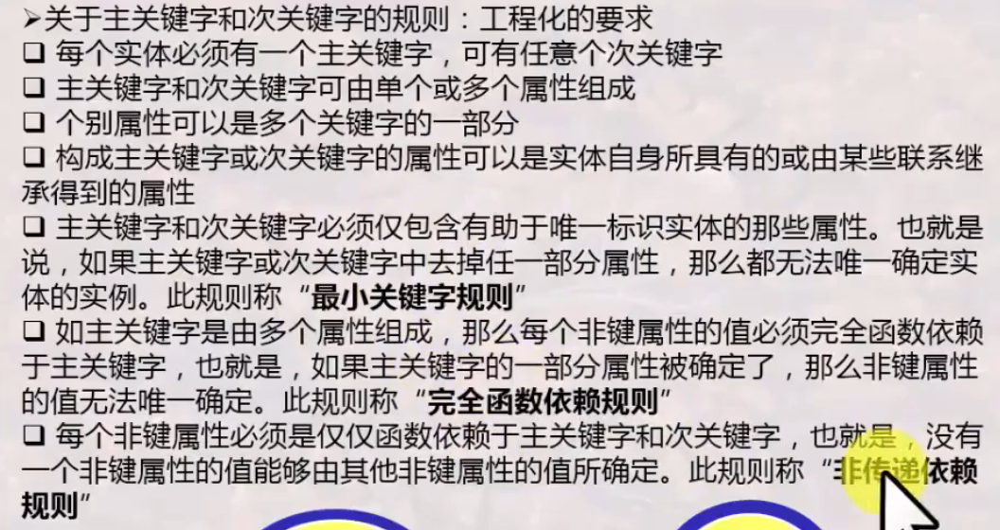
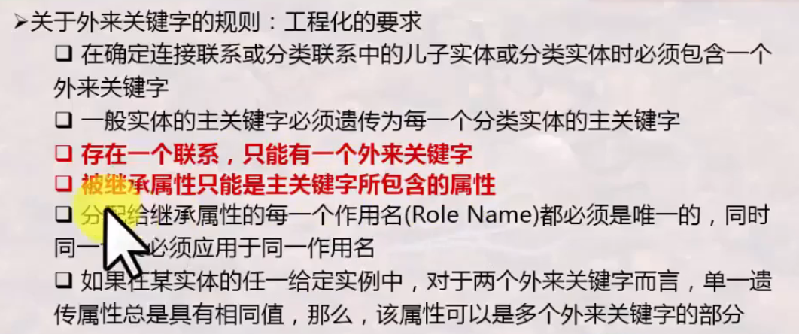
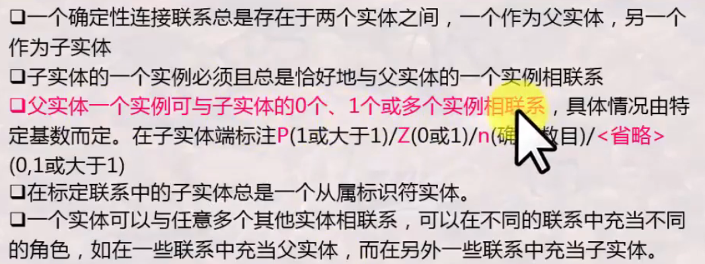
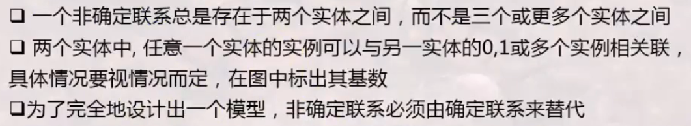
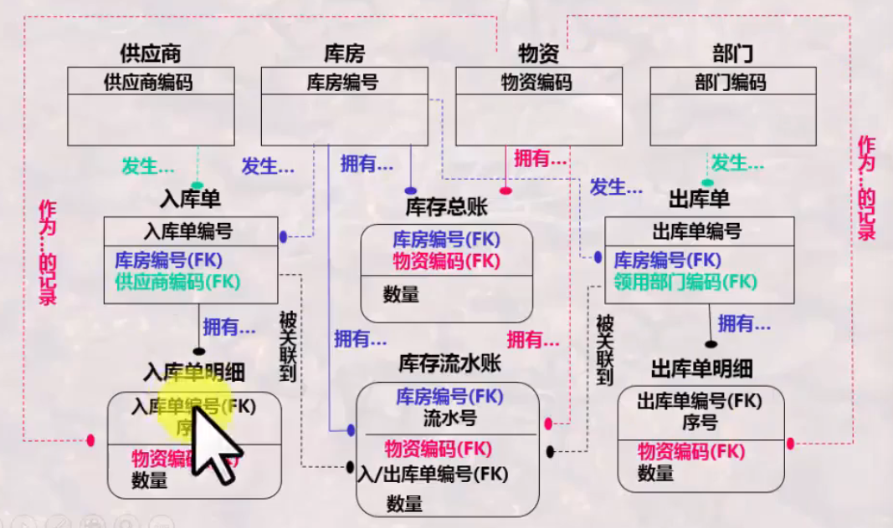
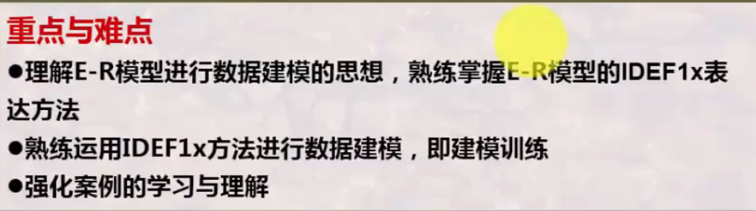
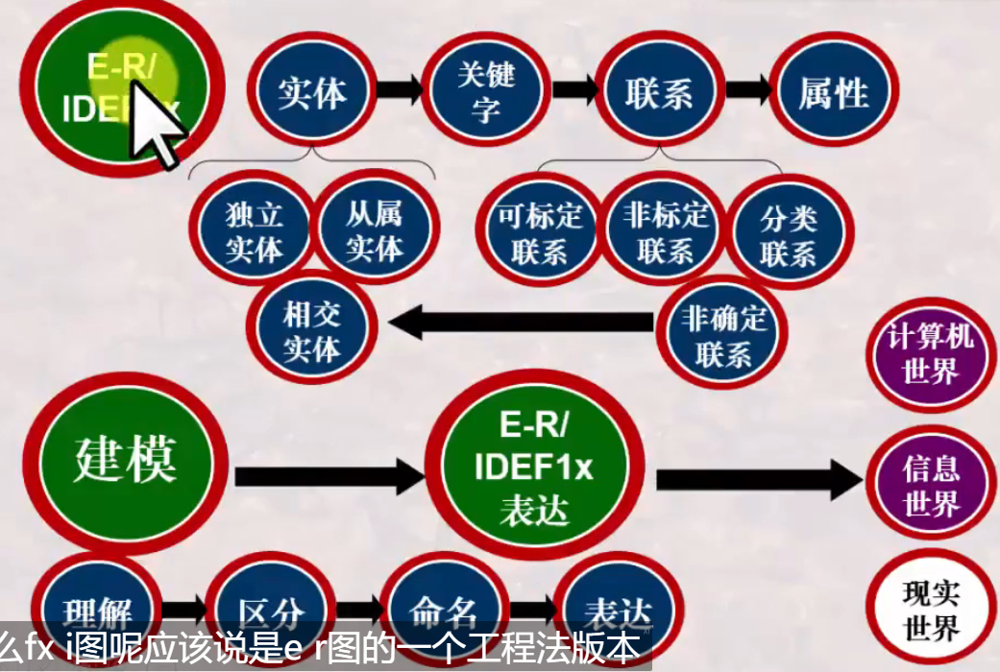

# 数据库系统 战德辰
## 第12讲 数据建模: 工程化方法及案例分析
IDEF1x是将E-R模型扩充语义含义而形成的(是E-R图的细化), 是一种进行数据建模或数据库工程化的方法
### IDEF1x两种实体的区分
 * 独立标识符实体/独立实体——强实体: 一个实体的实例都被唯一标识而不决定于它与其它实体的联系
 * 从属标识符实体/从属实体——弱实体: 一个实体的实例的唯一标识需要依赖于该实体与其它实体的联系(ep. 一份合同中的一项项条目)
 * 从属实体需要从其它实体继承属性作为关键字的一部分, 主关键字包含了外来属性的实体为从属实体
 * 独立实体用直角方形框, 从属实体用圆角方形框
 * 独立实体的主关键字没有外键, 从属实体的主关键字含有外键
 * 关于属性的工程化要求  
 
 * 关于关键字的工程化要求  
 
 * 外来关键字: (FK) 是其它实体的关键字, 工程化要求  
 
### IDEF1x的标定联系与非标定联系
 * 联系: 实体之间的一种连接关系
 * 标定联系: 子实体的实例都是由它与父实体的联系而确定。父实体的主关键字是子实体主关键字的一部分。
 * 非标定联系: 子实体的实例能够被唯一标识而无需依赖与其实体的联系, 父实体的主关键字不是子实体的主关键字。
 * 标定联系用实直线表示,  非标定联系用虚直线表示。在子实体一侧有圆圈, 联系名标注在直线旁
 * 工程化要求  
 
### IDEF1x的非确定联系
 * 实体之间多对多的联系, 必须分解为若干个一对多的联系来表达
 * 非确定联系通过引入相交实体(相关实体)来分解为若干个一对多的联系来表达
 * 工程化要求  
 
### IDEF1x的分类联系
 * 一个一般实体实例及多个分类实体实例构成的联系
 * 用于区分不同分类的属性, 称为鉴别器属性
 * 具体化: (自顶向下)实体的实例集中, 某些实例子集具有区别于该实例集内其它实例的特性, 可以根据这些差异特性对该实例集进行分组/分类, 这一过程称为具体化
 * 泛化: (自底向上)若干个实体集根据共有的性质, 可以合成较高层的实体。泛化是一个高层实体与若干个低层实体之间的包含关系
 * 在E-R图中用标记为ISA的倒三角形表示。
 * 高层实体的属性被低层实体自动继承, 低层实体特有的性质仅适用于某个特定的低层实例。
---
 * 完全分类联系: 分类完全集, 使用一圆圈带两个横线来刻画。
 * 非完全分类联系: 分类非完全集, 使用一圆圈带一个横线来刻画。
 * 分类实体必须具有特有的属性, 否则分类没有意义
---
 * 规则  
 
### IDEF1x建模之案例讲解
 * 作用/角色: 当一个实体与其父实体有多种联系时, 需使用"作用/角色"来区分每一种联系
 * 仔细分析信息源, 源可能是由若干实体合并后形成的, 实体是从源中按实体规则提取出来的
 * 仓储系统的数据模型  
 
### IDEF1x建模之案例作业点评
 * 通过IDEF1x图理解需求
 * 读图
   * 检查每个实体能否用重叠量词形容
   * 检查实体的关键字能否唯一确定每个实例
   * 检查实体之间联系绘制及命名的正确性
   * 检查属性继承的正确性
 * 不要把IDEF1x图当作流程图
### 总结
  
