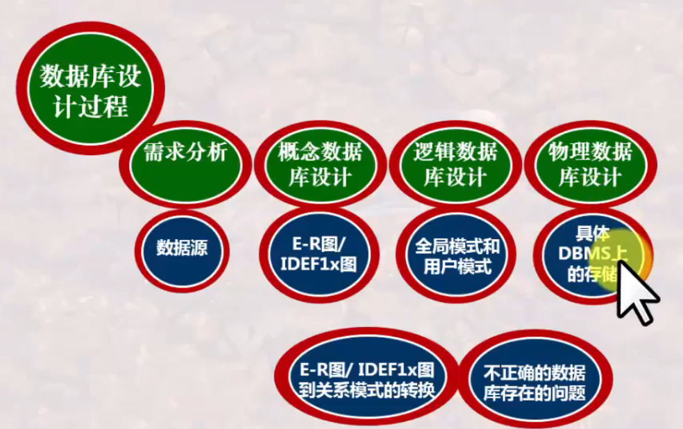

# 数据库系统 战德辰
## 第13讲 数据库设计过程
### 数据库设计过程与设计方法
 * 设计过程: 
   * 需求分析(收集需求和理解需求, "源")
   * 概念数据库设计(建立概念模型, "E-R图/IDEF1x图的绘制")
   * 逻辑数据库设计(建立逻辑模型, "关系模式", 包含全局模式和用户模式)
   * 物理数据库设计(建立物理模型, "Create Table", 包含物理数据组织等, 依赖于具体的DBMS)
---
  * 需求分析
    * 目标: 理解企业、企业业务过程与数据处理流程、理解数据处理的性能需求, 形成"源"清单和"属性"清单以及相关的详细描述
    * 对属性的命名要规范且含义明确, 尤其要注意多含义属性
    * 了解不同岗位划分->收集源形成源表->理解每一个源->形成并提交需求分析报告
  * 概念数据库设计
    * 目标: 进一步深入理解企业, 对信息源进行抽象, 发现信息之间的内在本质联系
    * 设计思路: 先局部后全局/先全局后局部 - 需求调研/合并局部需求/设计概念数据库模式/设计外部模式或视图
    * 局部E-R模式设计: 确定范围->实体定义->联系定义->属性分配->全局E-R模式设计
    * 全局E-R模式设计: 确定公共实体类型->合并两个局部E-R模式->检查并消除冲突->全局E-R模式优化
    * 消除冲突: (属性) 属性域的冲突/属性取值单位的冲突 (结构) 同一对象在不同应用中的抽象不同/同一实体在不同E-R图中的属性组成不同/实体之间的联系在不同E-R图中呈现不同类型 (命名)同名异义/异名同义
    * 全局E-R模式优化: 合并实体类型->消除冗余属性->消除冗余联系
    * 依据需求分析报告->识别实体与联系->绘制E-R图/IDEF1x图 用图表达业务规则->定义实体、联系及实体的属性构成->形成并提交概念数据库设计报告
  * 逻辑数据库设计
    * 目标: 用指定DBMS要求的模式描述方法, 给出概念数据库的逻辑模式描述
    * 依据概念数据库设计报告->转换成关系模型->检查逻辑数据库设计的正确性->定义全局模式和外模式->形成并提交逻辑数据库设计报告
  * 物理数据库设计
    * 目标: 结合指定DBMS物理数据库管理方法, 给出概念数据库的物理模式描述
    * 设计用户视图及访问控制规则, 以进行安全性控制->建立索引->设计使数据库运行达到最佳效率的措施->设计备份和恢复的步骤
    * 依据逻辑数据库设计报告->利用具体DBMS创建数据库/表->确定物理存储方式与存储空间->创建索引、视图->形成并提交物理数据库设计报告
### E-R图/IDEF1X向关系模式的转换
  转换的基本规则(E-R)
  * 实体-属性-关键字的转换
  * 复合属性的转换: 将每个分量属性作为复合属性所在实体的属性/将复合属性本身作为所在实体的属性 二选一
  * 多值属性的转换: 将多值属性与所在实体的关键字一起组成一个新的关系
  * 联系的转换
    * 一对一联系: (双方均部分参与)将联系定义为一个新的关系, 属性为参与双方的关键字属性; (一方全部参与)将联系另一方的关键字作为全部参与一方关系的属性
    * 一对多联系: 将单方参与实体的关键字作为多方参与实体对应关系的属性
    * 多对多联系: 将联系定义为新的关系, 属性为参与双方实体的关键字
  * 弱实体的转换: 所对应关系的关键字由弱实体本身的区分属性再加上所依赖的强实体的关键字构成
  * 泛化与具体化实体的转换: 高层实体和低层实体分别转为不同关系, 低层实体所对应的关系包括高层实体的关键字
    * 如果泛化实体实例是具体化实体实例的全部, 则可以不为高层实体建立关系, 低层实体所对应的关系包括上层实体的所有属性
  * 多元联系的转换
    * 多元联系可以通过继承参与联系的各个实体的关键字而形成新的关系, 这些继承过来的关键字可以作为新关系的关键字, 也可以新增一个区分属性作为关键字
  
  转换的基本规则(IDEF1x)
  * 只需要关注实体转换成关系, 而联系无需关注(联系的信息以及融入相关实体的关系描述中)
### 不正确数据库设计引发的问题及其解决
  * 不正确设计数据库引发的问题
    * 冗余: 数据库中存在大量冗余
      * 受控冗余: 实际上是联系的一个属性
      * 非受控冗余: 当数据发生改变时, 冗余数据同步更新困难
    * 插入异常: 插入数据时因为信息不完整而无法录入
    * 删除异常: 删除数据时关系到其它数据 ep. 某系所有同学被删除后该系的数据随之消失
  * 如何避免问题
    * 设计满足规范性, 由DBMS或数据库本身来保证
    * 设计不满足规范性, 由使用者或应用程序员使用过程中加以注意
  * 什么是规范的数据库设计
    * 需要分析数据库中的属性在取值方面的依存关系
    * 数据库设计理论: 数据依赖理论、关系范式理论、模式分解理论
  ### 总结
  
