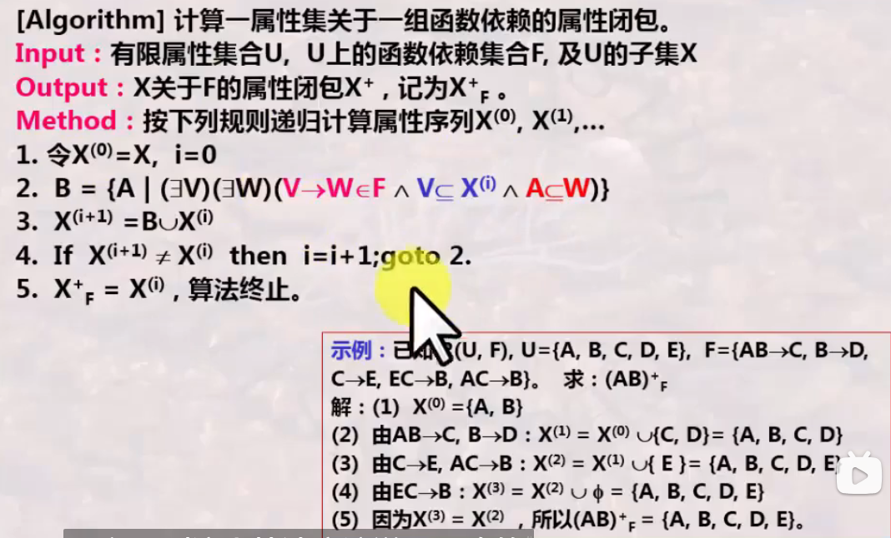
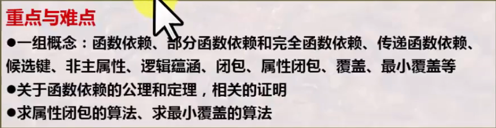
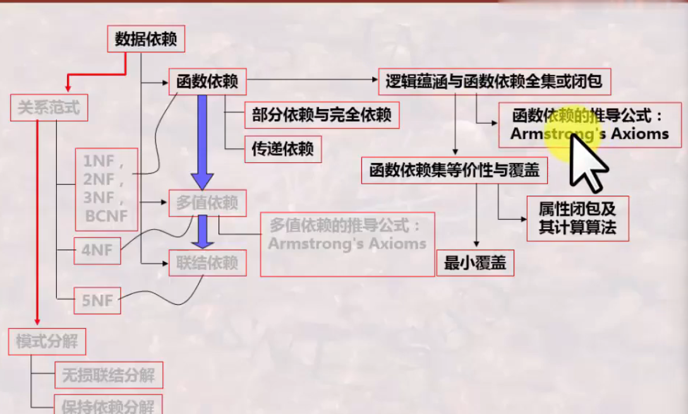

# 数据库系统 战德辰
## 第14讲 函数依赖及其公理/定理
### 函数依赖
设R(U)是属性集合U={A1,A2,...,An}上的一个关系模式, X,Y是U上的两个子集。若对R(U)的任意一个可能的关系r, r中不可能有两个元组满足在X中的属性值相等而在Y中的属性值不等, 则称为"X函数决定Y"或"Y函数依赖于X", 记作$X \to Y$
  * 函数依赖的分析取决于对问题领域的限定和分析, 取决于对业务规则的正确理解
  * 设计关系模式时, 除了给出属性全集之外, 还需给出数据依赖集合
  * 函数依赖的特性
    * 对$X \to Y$ , 但 $X \notin Y$ , 则称$X \to Y$ 为非平凡的函数依赖
    * 若$X \to Y$ , 则任意两个元组, 若X上值相等, 则Y上值必然相等, 则称X为决定因素
    * 若$X \to Y$ , $Y \to X$  , 则记作 $X \leftrightarrow Y$
    * 若Y不函数依赖于X, 则记作$X \nrightarrow Y$
    * $X \to Y$ , 有基于模式R的, 则要求对任意的关系r成立; 有基于具体关系r的, 则要求对某一关系r成立
    * 如一关系r的某属性集X, r中根本没用X上相等的两个元组存在, 则$X \to Y$ 恒成立
  * 重要的概念
    * 候选键: 设K为R(U)中的属性或属性组合, 若K能够完全决定U, 则称K为R(U)上的候选键
      * 可任选一候选键作为R的主键
      * 包含在任一候选键中的属性称为主属性, 其它属性称为非主属性
      * 若K是R的一个候选键, $S \supset K$, 则称S为R的一个超键(没有最小性要求)
    * 外来键: R(U)中的属性或属性组合X并非R的候选键, 但X是另一关系的候选键, 则X为R的外来键(外键)
    * 逻辑蕴涵: 设F是关系模式R(U)中的一个函数依赖集合, 若满足F的每个关系均满足$X \to Y$ ,则说F逻辑蕴涵$X \to Y$
    * 函数依赖闭包: 被F逻辑蕴涵的所有函数依赖集合称为F的闭包(Closure), 记作$F^+$ 。若$F^+=f$ , 则说F是一个全函数依赖族
### 完全函数依赖与传递函数依赖
 * 部分(p)或完全(f)函数依赖
 * 传递函数依赖: $X \to Y, Y \to Z, Y \notin X, Z \notin Y, Z \notin X, Y \nrightarrow X$ , 则称Z传递函数依赖于X
### 关于函数依赖的公理和定理
  * Armstrong公理
    * 设R(U)是属性集U={A1,A2,...,An}上的一个关系模式, F为R(U)的一组函数依赖, 记为R(U,F)。则有以下规则成立
      * 自反律: 若Y包含于X包含于U, 则X决定Y被F逻辑蕴涵
      * 增广律: 若X决定Y且非包含于F, 且Z包含于U, 则XZ决定YZ被F逻辑蕴涵
      * 传递律: 若X决定Y且Y决定Z, 则X决定Z被F逻辑蕴涵
    * 推论
      * 合并律: 若X决定Y且X决定Z, 则XZ决定YZ被F逻辑蕴涵
      * 伪传递律: 若X决定Y且WY决定Z, 则XW决定Z
      * 分解律: 若X决定Y且Z包含于Y, 则X决定Z
      * X决定Y可从F由公理导出, 当且仅当Y包含于属性闭包
      * F+ = G+ 等效于 F包含于G+ 且 G包含于F+
      * 每个函数依赖集F可被一个其右端至多有一个属性的函数依赖之集G覆盖
  * 属性(集)闭包
### 函数依赖集的最小覆盖
  * 覆盖: 对R(U)上的两个函数依赖集合F、G, 若$F^+=g^+$ , 则称F和G是等价的, 也称F覆盖G或者G覆盖F
  * 属性闭包的计算算法  
 
  * 最小覆盖: 满足以下条件
    * F中的每个函数依赖的右部是单个属性
    * 对任何X决定A属于F, 有F-{X决定A}不等价于F
    * 对任何X决定A属于F, Z包含于X, (F-{X决定A})∪{Z决定A}不等价于F
  * 每个函数依赖集F都有等价的最小覆盖$F^+$
### 总结
  
