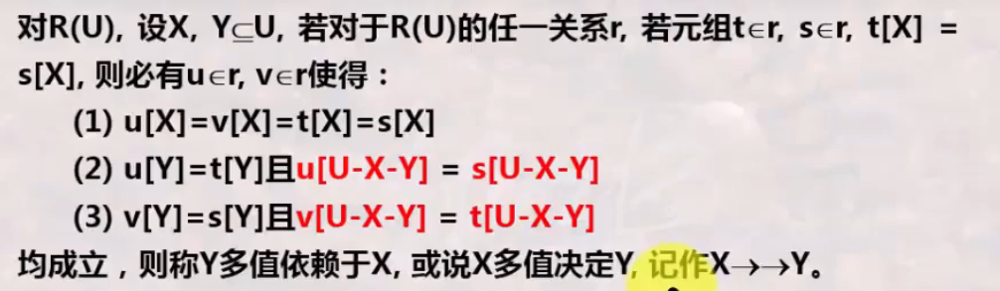
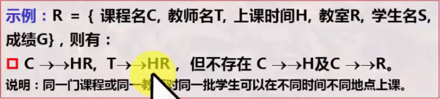

# 数据库系统 战德辰
## 第15讲 关系模式设计之规范形式
### 关系的第1NF和第2NF
* 若关系模式R(U)中关系的每个分量都是不可分的数据项, 则称R(U)属于第一范式, 记为$R(U) \in 1NF$
* 即所有分量都不可再分(1NF要求属性中不能有复合属性和多值属性及其组合)
* 处理方法
    * 将非1NF转换为1NF: 将复合属性处理为简单属性; 将多值属性与关键字单独组成新的关系
    * 引入新的数据模型处理: Object-Oriented Data Model
---
* 若$R(U) \in 1NF$ 且U中的每一非主属性**完全函数依赖**于候选键, 则称R(U)属于第二范式, 记为$R(U) \in 2NF$ 。  

* 第二范式**消除了非主属性对候选键的部分依赖**, 能够消除非受控的冗余。
* 处理方法
    * 分解关系模式
### 关系的第3NF和Boyce-Codd NF
* 若$R(U,F) \in 2NF$ 且R中不存在这样的情况: 候选键X, 属性组$Y \subseteq U$ 和非主属性A, $A \notin X, A \notin Y, Y \nsubseteq X, Y \nrightarrow X$ , 使得$X \rightarrow Y, Y \rightarrow A$ 成立。满足以上条件则称R(U)属于第三范式, 记为: $R(U) \in 3NF$
* 即第三范式是没有传递函数依赖的(可以简单理解为是否有冗余属性)。
* A和B决定C, A和C决定D, 所以A和B能决定C从而决定D, 此为有传递依赖, 不属于3NF。
* 第三范式**消除了非主属性对候选键的传递依赖**。
---
* 若$R(U,F) \in 1NF$ , 若对于任何$X \rightarrow Y \in F$ (或$X \rightarrow A \in F$ ), 当$Y \notin X$ (或$A \notin X$ )时, X必含有候选键, 则称R(U)属于Boyce-Codd范式, 记为: $R(U) \in BCNF$ 。
* 如果一个关系模式上面的每一个函数依赖都依赖于X且X包含于候选键, 则其满足Boyce-Codd范式。
* 即Boyce-Codd范式是没有不依赖于候选键的函数依赖存在的。
* 关系模式分解成BCNF
    * 将左侧不含候选键的函数依赖单独组成一个关系, 将包含候选键的组成一个关系
### 多值依赖及其公理定理
* 多值依赖的定义  

* 多值依赖的特性
    * 直观地, 对于X给定值, Y有一组值与之对应(0或n个)且这组Y值不以任何方式与U-X-Y中属性值相联系, 有$X \rightarrow \rightarrow Y$ 。
    * 若交换t, s的Y值而得到的新元组仍在r中, 则$X \rightarrow \rightarrow Y$ 。
    * X,Y不必不相交, u,v可以与t,s相同
    * 函数依赖是多值依赖的特例
    * 令$Z=U-X-Y$, 有$X \rightarrow \rightarrow Z$, 若$Z=\phi$ ,则必有$X \rightarrow \rightarrow Y$ 。(互补性)  
    
---
* 多值依赖的Armstrong公理(了解)
    * 多值依赖互补律/对称性: 若$X \rightarrow \rightarrow Y$ , 则$X \rightarrow \rightarrow U-X-Y$
    * 多值依赖增广律: 若$X \rightarrow \rightarrow Y$ 且$V \subset W$ , 则$WX \rightarrow \rightarrow VY$
    * 多值依赖传递律: 若$X \rightarrow \rightarrow Y$ , $Y \rightarrow \rightarrow Z$ , 则$X \rightarrow \rightarrow Z-Y$
    * 若$X \rightarrow Y$ , 则$X \rightarrow \rightarrow Y$
    * 若$X \rightarrow \rightarrow Y$ , $Z \subseteq Y$ 且对于某个与Y不相交的W有$W \rightarrow Z, W \cap Y=\phi$ , 则有$X \rightarrow Z$
* 引理(了解)
    * 多值依赖合并律: 若$X \rightarrow \rightarrow Y$ 且$X \rightarrow \rightarrow Z$ , 则$X \rightarrow \rightarrow YZ$
    * 多值依赖伪传递律: 若$X \rightarrow \rightarrow Y$ 且$WY \rightarrow \rightarrow Z$ , 则$X \rightarrow \rightarrow Z-WY$ 
    * 混合伪传递律: 若$X \rightarrow \rightarrow Y, XY \rightarrow Z, $ 则$X \rightarrow \rightarrow Z-Y$
    * 多值依赖分解率: 若$X \rightarrow \rightarrow Y, X \rightarrow \rightarrow Z$ 则$X \rightarrow \rightarrow Y-Z, X \rightarrow \rightarrow Z-Y, X \rightarrow \rightarrow Y \cap Z$ 
### 关系的第4NF(了解)
* 设$R(U) \in 1NF$ , D是其上的一组依赖(函数依赖或多值依赖), 对任意$X \rightarrow \rightarrow Y \in D$ , 若$Y \neq \phi, Y \nsubseteq X, XY \neq U$ , 必有X为超键, 则称R(U)满足第四范式, 记为: $R(U) \in 4NF$ 。
* 第四范式消除了非主属性对候选键以外属性的多值依赖。如果有多值依赖, 则一定依赖于候选键。
* 若R上仅存在函数依赖, 则 若有R属于BCNF, 即有R属于4NF
* 若R属于4NF, 则有R属于BCNF
---
* W4NF 弱第四范式(W4NF不一定是BCNF)
### 总结
  
