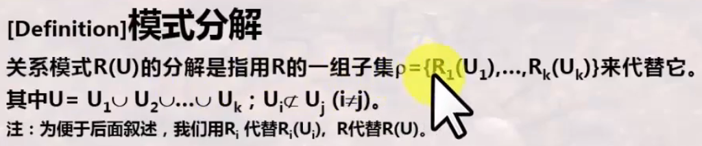
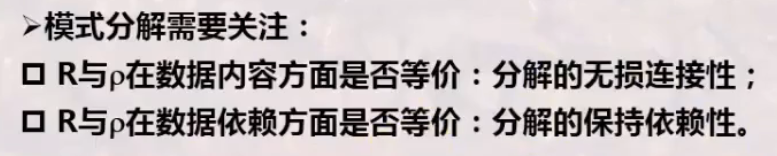
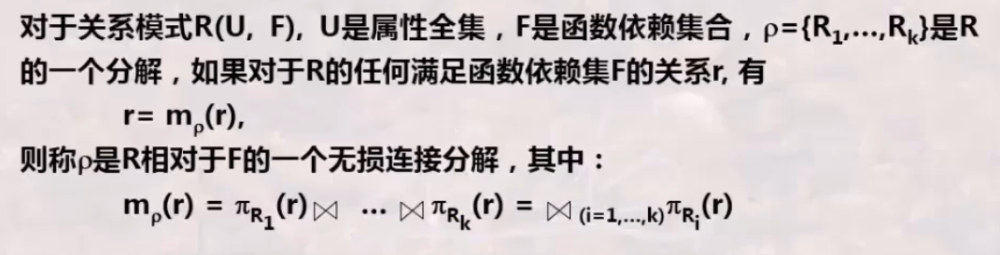
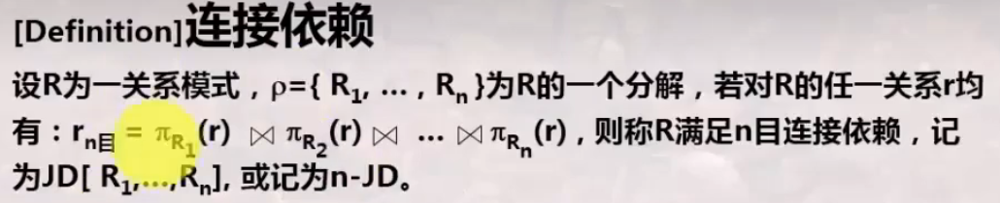
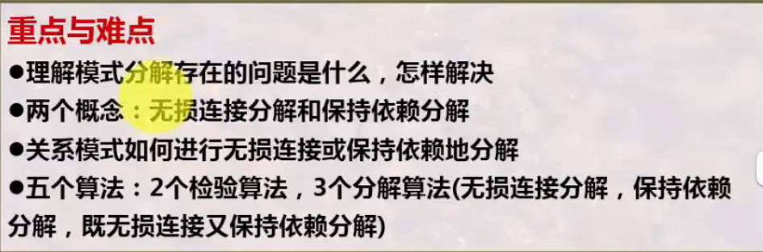
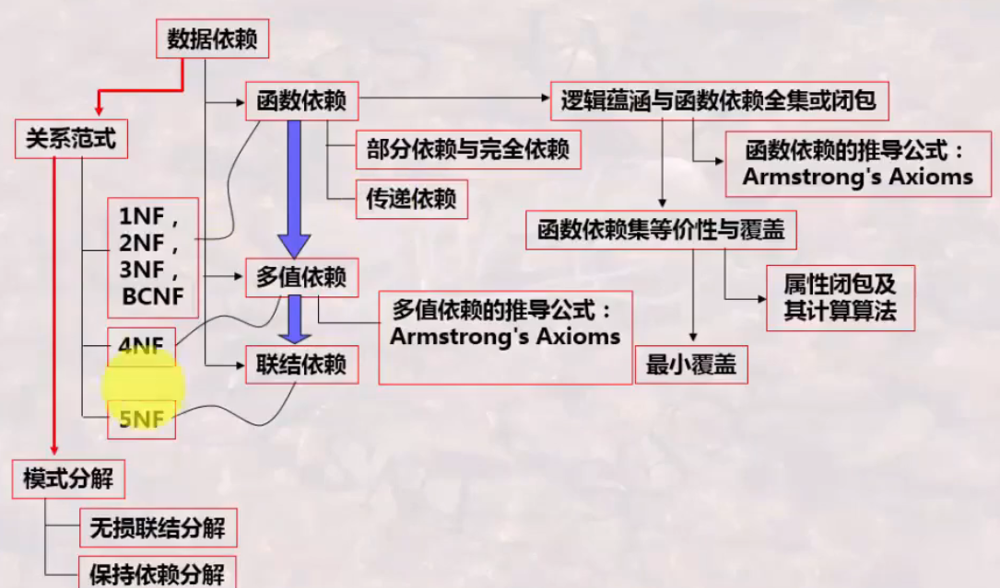

# 数据库系统 战德辰
## 第16讲 模式分解存在什么问题(模式分解理论)
### 模式分解存在什么问题
**模式分解的概念**  
  
**模式分解需要关注**  
  
**特性**
* 拆分后再投影回去可能增加信息, 但投影后再连接起来同样等价
* 模式分解后可能有约束丢失
### 无损连接分解及其检验算法
  
检验算法 视频12:00  
示例 视频16:20  
简单判断无损连接: 对两个关系时, R1∩R2决定R1-R2 或 R1∩R2决定R2-R1 时为无损连接
**性质**
* 无损连接的无损连接, 整体上依然是无损连接
### 保持依赖分解及其检验算法
  
* 即分解后原有的依赖依然全部保持着(哪怕分散在各个新关系中)
* 保持依赖的分解可能不是无损连接的
* 无损连接的分解可能不是保持依赖的
### 关系模式无损连接或保持依赖的分解算法
### 连接依赖与第5NF(了解)
**连接依赖(JD)**  
  
* 按照这样依赖的方式进行分解, 分解的结果始终保持无损连接性

**5NF**
* 当且仅当关系模式R的每个连接依赖均按其候选键进行连接运算时, 则称R是第五范式的
* 第五范式消除了不按候选键连接的连接依赖, 但是目前的语义背景抽象
* 第五范式也称投影连接范式, 即PJNF
### 数据库设计需要知道的
* 保证数据库设计的正确性(应用数据库设计理论)
* 数据依赖理论: 用于判断是不是符合关系范式
* 关系范式理论: 有哪些关系范式
* 模式分解理论: 不满足关系范式时如何分解, 分解时会存在什么问题
---
* 哪些属性被组织成一个关系?
* 是一个大关系模式呢, 还是若干小关系模式?
* 大关系模式/小关系模式存在什么问题?
* -> 关系模式设计需要折中: 时间与空间的效率平衡
* -> 通常建议关系模式符合BCNF即可。
### 总结
  
