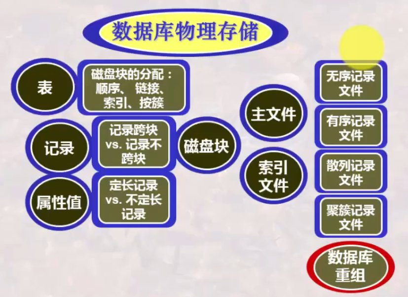

# 数据库系统 战德辰
## 第17讲 数据库物理存储
### 基础回顾-计算机系统的存储体系
KB - MB - GB - TB - PB - EB - ZB - YB - BB  
**两个基本问题如何解决**
* 如何高效率存储? -数据组织与索引
* 如何快速检索? -查询实现与查询优化
### 磁盘的结构与特性
* 磁盘数据读写时间: 寻道(1-20ms); 旋转(0-10ms); 传输(每4KB页<1ms)
* 物理存取算法考虑的关键: 降低IO次数/降低排队等待时间/降低寻道or旋转延迟时间
* RAID技术: 并行处理/可靠性
    * raid0: 块级拆分但无冗余
    * raid1: 镜像处理-每一个磁盘都有一个镜像磁盘
    * raid2: 位交叉纠错处理
    * raid3: 位交叉校验
    * raid4: 块交叉校验
    * raid5: 块交叉分布式校验
    * raid6
### DBMS数据存储与查询实现的基本思想
### 数据库之表和记录与磁盘块的映射
* 记录非跨块存储/跨块存储(指针连接)
* 表所占磁盘块的分配方法: 连续分配(扩展困难)/链接分配(访问速度问题)/按簇分配/索引分配
### 数据库之文件组织方法
* 数据组织要考虑更新和检索需求
    * 更新涉及数据存储空间的扩展与回收问题
    * 检索将涉及扫描整个数据库的问题、大批量处理数据问题
    * 不同的需求要求不同的数据组织方法和存取方法
    * 一种文件组织可以采取多种存取方法进行访问
---
* 无序记录文件(堆文件)
    * 更新效率高, 检索效率低
    * 数据库重组: 移走被删除的记录使有效数据记录连续存放, 回收未利用的空间
* 有序记录文件(排序文件)
    * 按某属性或属性组值的顺序插入, 磁盘上存储的记录是有序的, 检索效率高
    * 用于排序的属性称为排序字段, 通常使用关系中的主码, 称为排序码
    * 更新效率可能很低
    * 改进措施: 为将来可能插入的元组预留空间 或 使用临时的无序文件(称为溢出文件)保留新增的记录
* 散列文件(Hash file)
    * 依据散列函数计算桶号(bucket), 检索效率和更新效率都有所提高
    * 用于进行散列函数计算的属性称为散列字段(hash field), 散列字段通常也采用关系中的主码: 散列码(hash key)
    * 不同记录可能被hash到同一个bucket, 此时还需要在bucket中顺序检索出某记录
    * 链接法: 以指针设置溢出桶以处理溢出
* 聚簇文件(clustering file)
    * 将具有相同或相似属性值的记录存放于连续的磁盘簇块中
### 总结
  
