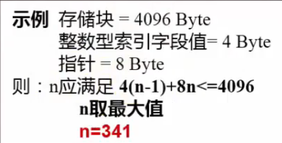
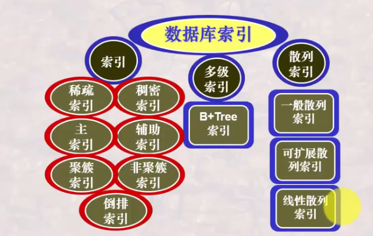

# 数据库系统 战德辰
## 第18讲 数据库索引技术
### 为什么需要索引与什么是索引
* 索引是定义在存储表基础上, 有助于快速定位所需记录的辅助存储结构, 由一系列存储在磁盘上的索引项构成, 每一索引项又由两部分构成(索引字段, 行指针)
* 存储索引项的文件为索引文件, 相对应, 存储表又称为主文件
* 索引文件存在与否不改变存储表的物理存储结构, 但是其存在可以明显提高存储表的访问速度
* 索引文件的组织方式
    * 排序索引文件
    * 散列索引文件
* 索引的一般特点
    * 在一个表上可以针对不同的属性或属性组合建立不同的索引文件
    * 通过检索一个小的索引文件, 再有针对的读取非常大的主文件中的相关记录
    * 有索引时, 更新操作必须同步更新索引文件和主文件
* 衡量索引性能的好坏
    * 访问时间
    * 插入时间
    * 删除时间
    * 空间负载
    * 支持存取的有效性
* 基本知识
    * 定义Table后, 若定义了主键, 系统会自动创建主索引
    * 索引可以由用户创建, 也可以由用户撤销
    * DBMS自动维护所有的索引, 使其与Table保持一致
    * Table被删除后, 定义在Table上的所有索引将自动被撤销
* 创建索引的语句  

* 对经常出现在索引条件、连接条件、分组计算条件中的属性可建立索引
* 建立索引还需要考虑索引的类型: 索引如何支持存取的有效性
### 索引的简单分类
* 稠密索引: 对于主文件中的每一个记录, 都有一个索引项和它对应, 这样的索引称为稠密索引(dense index)
* 稀疏索引: 对于主文件中的部分记录, 有索引项和它对应, 称为非稠密索引或稀疏索引(sparse index)
---
* 稀疏索引如何定位记录
    * 找相邻的小于K的最大索引字段值所对应的索引项
    * 从该索引项所对应的记录开始顺序进行Table的检索
* 稀疏索引的使用要求主文件必须是按对应索引字段属性排序存储
* 相比于稠密索引: 空间占用更少, 维护任务更轻, 但速度更慢
* 平衡: 索引项不指向记录指针, 而是指向记录所在存储块的指针——主索引
---
* 主索引: 对每一存储块有一索引项与其对应, 又称为锚记录(anchor record)。主索引通常建立在有序主文件基于主码的排序字段上。主索引是稀疏索引。
* 辅助索引: 定义在主文件的任一或多个非排序字段上的辅助存储结构。辅助索引是稠密索引, 其检索效率有时相当高。
* 区别
    * 一个主文件仅可以有一个主索引, 但是可以有多个辅助索引。
    * 主索引通常建立于主码/排序码上面; 辅助索引建立于其它属性上面
    * 可以利用主索引重新组织主文件数据, 但辅助索引不能改变主文件数据
    * 主索引是稀疏索引, 辅助索引是稠密索引
---
* 聚簇索引: 索引中邻近的记录在主文件中也是临近存储的
* 非聚簇索引: 索引中邻近的记录在主文件中不一定是邻近存储的
* 如果主文件的某一排序字段不是主码, 则该字段上每个记录的取值不唯一, 此时该字段称为聚簇字段; 聚簇索引通常定义在聚簇字段上
* 一个主文件只能有一个聚簇索引文件, 但可以有多个非聚簇索引文件
* 主索引通常是聚簇索引, 辅助索引通常是非聚簇索引
* 主索引/聚簇索引是能够决定记录存储位置的索引; 非聚簇索引则只能用于查询
---
* 倒排索引: 以关键词为单位建立的广泛用于文本查询的索引
* 多级索引: 索引较多时, 可以对索引再建立索引, 以此类推
* 多属性索引: 索引字段由Table的多个属性值组合在一起形成的索引
* 散列索引: 使用散列技术组织的索引
* 网格索引: 使用多索引字段进行交叉联合定位与检索
### B+树索引
* B+树索引是一种多级索引, 一种以树型数据结构来组织索引项的多级索引
* 一块中索引项的组织
    * 一块中有n-1个索引项和1个指针  
    
    * Ki——索引字段值
    * Pj——指针, 指向索引块或数据块或数据块中记录的指针
* B+树的特性
    * 能够自动保持与主文件大小相适应的树的层次
    * 每个索引块的指针利用率都在50%-100%之间
* 非叶结点指针指向索引块, 叶结点指针指向主文件的数据块或数据记录
* 一个索引块实际使用的索引指针数d满足(根节点除外): n/2<=d<=n
* 根节点至少2个指针被使用
---
* 索引字段值重复出现于叶结点和非叶结点
* 指向主文件的指针仅出现于叶结点
* 所有叶结点即可覆盖所有键值的索引
* 索引字段值在叶结点中按顺序排列
* 仅叶结点块的集合就是主文件的完整的索引
* 保证结点的平衡性(级数相同)
    * 插入/删除记录时, 伴随着结点的分裂与合并, 调整部分结点块中的索引项
---
* 算法
    * 如何利用B+树进行检索
    * 如何利用B+树进行增加和删除操作
    * B+树的增加和删除操作时如何进行分裂和合并
    * 什么条件下分裂与合并
    * 分裂与合并时如何调整B+树的指针
* 方式
    * 用B+树建立稠密索引
    * 用B+树建立稀疏索引
    * 用B+树建立非键属性稀疏索引(主文件按非键属性排序, 索引字段无重复)
    * 用B+树建立非键属性稠密索引(索引字段是主文件的非键属性, 索引字段值有重复)
---
* B Tree
    * 不同
        * 索引字段值仅出现一次(出现在叶结点或非叶结点中)
        * 指向主文件的指针出现于叶结点或非叶结点
        * 所有结点才能覆盖所有键值的索引
    * 相同
        * 插入记录时, 伴随着结点的分裂与合并
        * 层数相同, 平衡
---
* 插入过程
    * 寻找保存键值记录的叶子结点
    * 应插入结点已满, 则申请新结点
    * 同时调整应插入但未插入结点中的键值记录, 使其均衡存放在两个叶结点中(分裂)
    * 调整指针使其指向新的结点
    * 寻找指向新叶子结点的非叶结点
    * 应插入结点已满, 则申请新结点
    * 同时调整应插入但未插入结点的键值记录, 使其均衡存放于两个非叶结点中(分裂)
    * 调整各结点指针使其指向正确
    * 注意事项
        * 每一个结点全满的时候进行分裂
        * 由叶结点向根结点逐层处理
    * 指针调整
* 删除与合并过程
    * 叶子结点中寻找等于键值的记录, 删除相应的指针及主文件中对应的记录
    * 调整其左侧(或右侧)结点及本结点中的键值记录, 使其均衡存放于两个叶结点中
    * 如有调整, 则进一步调整其上层非叶结点, 重新确定其键值, 以满足大于等于其键值的都在右侧
    * 注意事项
        * 合并(当指针数目少于规定数目时)
        * 由叶结点向根结点逐层处理
        * 指针调整
* 要点概括
    * 插入记录时
        * 可能需要分裂: 当索引块充满时, 需要分裂
        * 分裂可能引发连锁反应, 由叶结点直至根结点
        * 分裂后需要仔细调整索引键值及指针
        * 注意叶子结点之间链接关系的调整
    * 删除记录时
        * 可能需要合并: 从相邻结点中转移索引项
        * 可能需要合并: 两个结点块合并成一个结点块
        * 合并可能引发连锁反应, 由叶结点至根结点
        * 合并后需要仔细调整索引值及指针
        * 注意叶子结点之间链接关系的调整
### 散列索引
* 有M个桶, 每个桶是有相同容量的存储地
* 散列函数将键值k进行映射
* 将具有键值k的记录Record(k)存储在对应h(k)编号的桶中
* 目标: 选择一个合适的散列函数, 将一个Record集合均匀地映射到M个桶中
* 散列索引
    * 内存数据可采用散列确定存储页, 主文件可采用散列确定存储块, 索引亦可采用散列确定索引项的存储块
    * 一个桶可以是一个存储块, 也可以是若干个连续存储块
    * 目标: 最好没有溢出桶, 每一个散列值仅有一个桶, 读写每一个键值都只读写一个存储块
* 期望将所有数据分布均匀地存储于M个桶中, 使每个桶的数据成为具有某种特征值h(k)的数据集合
* 桶的数目的确定: 在键值几倍于桶的数目时, 每一个散列值都可能多于一个桶, 形成一个主桶和多个溢出桶的列表, 需要二次检索
* 散列
    * 桶的数目M是固定值——静态散列索引
        * M过大则浪费; M过小则产生更多溢出桶, 增加检索时间
    * 桶的数目随键值增多而动态增加——动态散列索引
        * M的变化是否影响原有内容; 是否需要重新进行散列存储
* 可扩展散列索引
    * 取前i位确定索引块
    * 如未满, 则存入; 如已满, 则需要扩展散列桶, 进行分裂
    * 不增加; i增加1
    * 重新散列该块的数据到两个块中, 其它不变
    ---
    * 存在的问题
        * 当桶数组需要翻倍时, 要做大量的工作
        * 桶数翻倍时, 可能装不下或要占用更大的空间
        * 如果每块的记录数很少, 那么可能某一块的分裂比在逻辑上需要的分裂时间提前很多
* 线性散列索引
    * 使得桶数n的选择总是使存储块的平均记录数保持与存储块所能容纳的记录总数成固定的比例, 超过比例则桶数增长1块, 分裂
    * 存储块并不总是可以分裂, 允许有溢出块
    * 用来做桶数组项序号的二进制位数是\[log2n\], 其中n为当前的桶数。
### 总结
  
