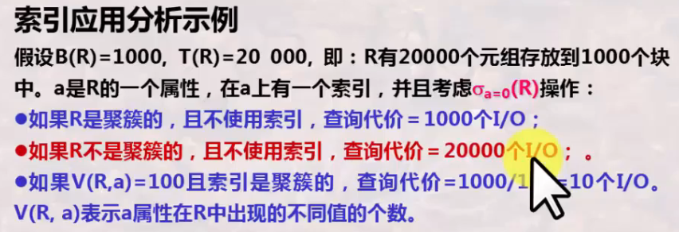
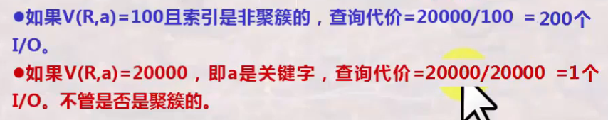
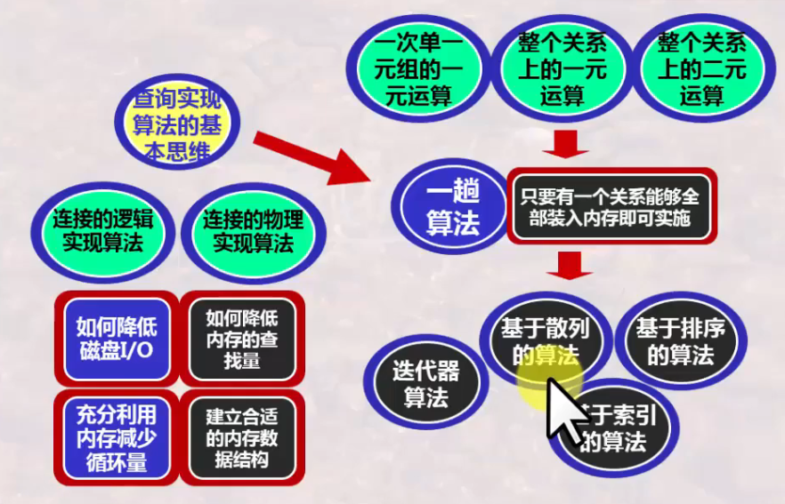

# 数据库系统 战德辰
## 第19讲 数据库查询实现算法-I(一趟扫描算法)
### 数据库查询实现算法概述
* 物理查询优化
    * 获取数据库的相关信息(定期统计)
    * 选择相应操作的例行程序
    * 依据相关信息进行代价估算, 选择代价最少的例行程序及确定相应的参数
    * 形成查询计划: 以基本的例行程序为基本步, 确定这些例行程序的执行顺序
* 数据库的三大类操作
    * 一次单一元组的一元操作(选择, 投影)
    * 整个关系的一元操作(去重, 分组, 排序) -> 一趟扫描算法、两趟扫描算法、多趟扫描算法 -> 基于排序的算法、基于散列的算法、基于索引的算法
    * 整个关系的二元操作(并, 交, 叉, 乘积, 连接等)
### 以连接操作为例看逻辑实现算法与物理实现算法
* 物理算法需要考虑
    * 关系是存储在磁盘上的, 磁盘是以磁盘块为操作单位, 首先要被装载进内存, 再进行元组的处理
* 算法
    * 表空间扫描法
        * 基本实现算法: 适用于任何情况, 3块内存即可, 但复杂性高: BR+BR*BS
        * 全主存实现算法: 要求内存能够完全装载两个关系, 算法复杂性低: BR+BS
        * 半主存实现算法: 要求内存能够完全装载一个关系, 算法复杂性低: BR+BS
        * 大关系实现算法: 适用于任何情况, 尤其是大关系情况下比基本实现算法好, 算法复杂性低: BR(BS/(M-2))+BS
    * 归并排序连接算法
    * 散列连接算法
    * 索引连接算法
### 利用迭代器构造查询实现算法
* 迭代器指迭代的读取一个集合中的每一个元素, 而封装其读取细节
### 几个关系操作的一趟扫描算法
* 关系/表数据的读取
    * 聚簇关系——关系的元组集中存放(一个块中仅是一个关系中的元组)
        * TableScan(R)——表空间扫描算法: 扫描结果未排序 B(R)
        * SortTableScan(R): 扫描结果排序 3B(R)
        * IndexScan(R)——索引扫描算法: 扫描结果未排序 B(R)
        * SortIndexScan(R): 扫描结果排序 B(R) or 3B(R)
    * 非聚簇关系——关系的元组不一定集中存放
        * 扫描结果未排序: T(R)
        * 扫描结果排序: T(R) + 2B(R)
* 去重复: &(R)
    * 需要在内存中保存已处理过的元组
    * 当新元组到达时, 与之前处理过的元组进行比较
    * 建立不同的内存数据结构, 来保存之前处理过的数据, 以便快速处理整个关系上的操作
    * 算法复杂性: B(R)
    * 应用条件: B(&(R))<=M
* 分组聚集: yL(R)
    * 需要在内存中保存所有的分组
    * 保存每个分组上的聚集信息
    * 建立不同的内存数据结构, 来保存之前处理过的数据, 以便快速处理整个关系上的操作
    * 算法复杂性: B(R)
    * 应用条件: 所有分组的数量应能在内存中完整保存
* 集合/包上的操作: 并交叉
    * 集合的操作需要去重, 包的操作需要计数
    * 算法复杂性: B(R)+B(S)
    * 应用条件: min(B(R),B(S))<=M
### 基于索引的查询实现算法
* 基于索引的选择算法
    * 选择条件中有涉及到索引属性时, 可以使用索引辅助快速检索
    * 在某些属性上存在着索引, 可能在多个属性上都存在着索引
    * 索引应用分析  
      
    
* 基于有序索引的连接算法 - Zig-Zag连接算法
### 总结
  
