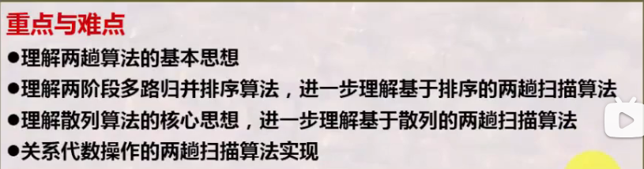
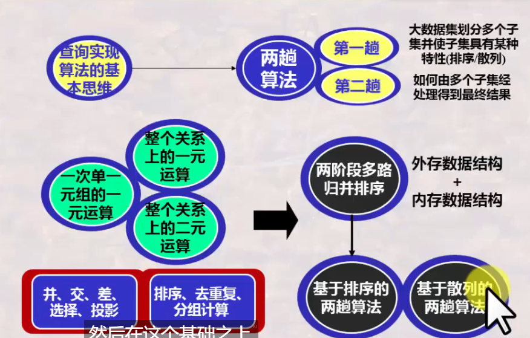

# 数据库系统 战德辰
## 第20讲 数据库查询实现算法-II(两趟扫描算法)
### 为什么需要两趟扫描算法&两趟算法的基本思想
* 理论上一个元组需要与所有元组进行比较, 才能确定是否重复, 而这些需要内存
* 基本思路
    * 第一趟: 划分子集, 并使子集具有某种特性, 如有序或相同散列值等
    * 第二趟: 处理全局性内容单独操作, 形成结果关系。比如多子集间的归并排序, 相同散列值子集的操作等
### 两阶段多路归并排序(TPMMS)算法
* 内排序问题: 待排序的数据可一次性装入内存中, 排序者可以随意选择算法进行排序(插入/选择/冒泡)
* 外排序问题: 排序者需要将数据分批装入内存分批处理
* 外排序问题基本排序策略
    * 将数据划分为N个子集合, 使得每个子集合的块数小于内存可用块数(BP/N<BM>), 每个子集合都可装入内存并采用内排序算法排好后重新写回磁盘。
    * 问题转化为 N个已排序的子集合数据怎样应用内存进行总排序? -TPMMS
    * 第一趟: 划分子集并子集排序 - 内存所有块用于处理一个子集合
    * 第二趟: 各子集间的归并排序
    * 算法效率: IO数4BP, 子集合排序阶段读写2BP, 归并阶段读写2BP ——3B(R) 不考虑结果写回;4B(R) 考虑结果写回
    * 算法应用条件: 子集合数<\BM; 子集合块数<\BM; 大数据集块数<\BM^2
### 基于排序的两趟扫描算法
* 去重复操作
    * 第一趟: 划分子表, 进行子表排序
    * 第二趟: 归并阶段, 在排序的基础上直接剔除重复的记录
    * 算法复杂性同TPMMS 3B(R) 不考虑输出; 4B(R) 考虑输出
* 分组聚集操作
    * 第一趟: 划分子表, 进行子表排序
    * 第二趟: 归并阶段, 在排序基础上, 将不重复的记录作为新分组输出, 将重复记录进行分组聚集计算
    * 算法复杂性同TPMMS 3B(R) 不考虑输出; 4B(R) 考虑输出
* 并、交、叉操作
    * 包并: 直接两个关系合并即可
    * 集合并: 需要两趟, 去重复
    * 交: 需要两趟, 需要处理出现次数或去重复(集合交: t在R和S中都出现就输出; 包交: 输出t的次数是min(tR,tS) )
    * 叉: 需要两趟, 需要处理出现次数或去重复(集合差: 当且仅当t出现在R中但不出现在S中输出; 包差: 输出t的次数是tR-tS )
* 连接运算
    * 第一趟: 划分R和S的子表并进行子表排序, 排序均基于Y属性排序
    * 第二趟: 归并时注意是R的输入还是S的输入, R和S的两路输入之间进行连接检查并连接后输出
    * 也称"排序-连接 SORT-JOIN"算法、"归并-连接 MERGE-JOIN"算法、"排序-归并-连接 SORT-MERGE-JOIN"算法
### 基于散列的两趟扫描算法
* 基本思想
    * 将大数据集上的操作转换为某个子集上的操作
    * 第一趟: 散列子表, 用散列函数将原始关系划分为M-1个子表, 并存储
    * 第二趟: 处理每个子表, 用**另一散列函数**将子表读入内存并建立内存结构, 进行不同操作的处理
* 去重复操作
    * 第一趟: 将原始关系通过hp散列成M-1个子表, 并存储
    * 第二趟: 处理每个子表。将每个子表读入内存, 并用另一函数hr形成散列数据结构, 进行去重复操作
    * 算法复杂性同TPMMS 3B(R) 不考虑输出; 4B(R) 考虑输出
    * 元组在子表上不重复, 则在大关系中亦不重复(MOD M)
* 分组聚集操作
    * 第一趟: 将原始关系通过hp散列成M-1个子表, 并存储
    * 第二趟: 处理每个子表。将每个子表读入内存, 并用另一函数hr形成散列数据结构, 进行分组聚集操作
    * 算法复杂性同TPMMS 3B(R) 不考虑输出; 4B(R) 考虑输出
    * hp = 计算分组属性的值 MOD M
    * hr = 以分组属性的二进制位串重新计算值 MOD M
* 并、交、叉操作
    * 使用相同的散列函数散列两个操作对象R和S
    * 包并: 无需两趟, 直接合并
    * 集合并: 需两趟, 需要去重复
    * 交、叉: 类似方法处理
* 连接操作
    * 以连接属性Y作为散列关键字, 设计散列函数
    * 第一趟: 使用相同的散列函数散列两个操作对象R和S
    * 第二趟: 将Si整体散列读入到内存中, 再依次处理Ri的每一块。进行连接。
    * 称为"散列连接"算法
### 总结
  
