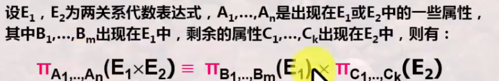
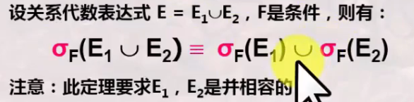
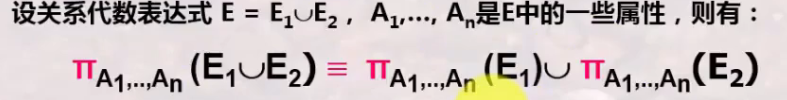
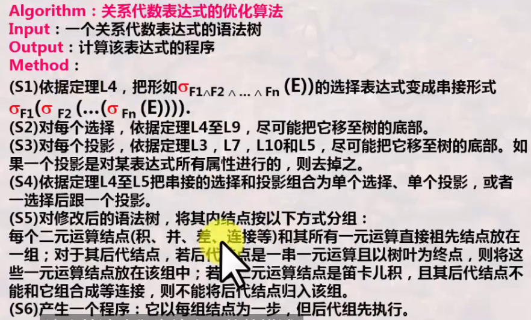
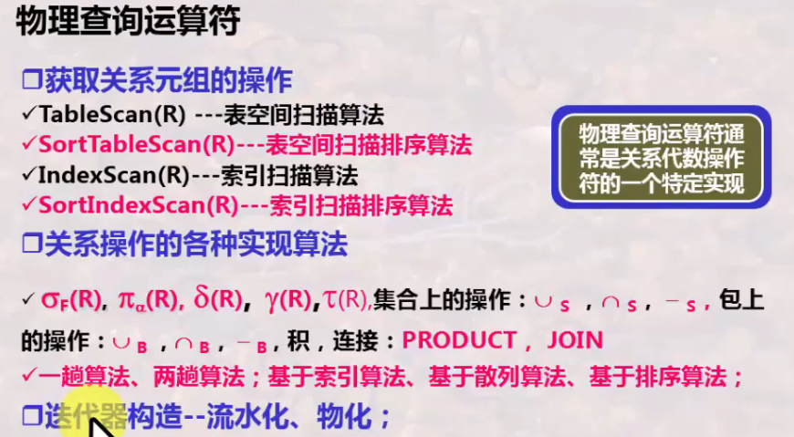
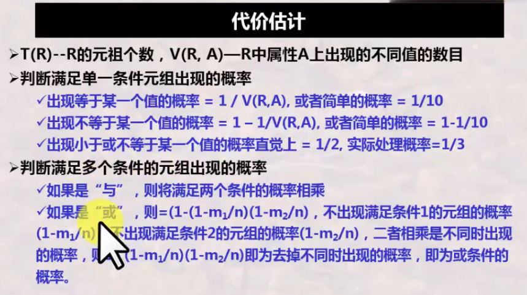
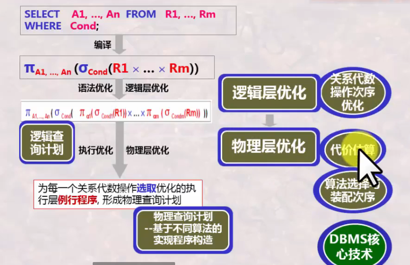

# 数据库系统 战德辰
## 第21讲 数据库查询优化技术
### 为什么要以及什么是查询优化
* 语义优化: 利用模型的语义及完整性规则, 优化查询
* 语法优化(逻辑层优化): 利用语法结构, 优化操作执行顺序
* 执行优化(物理层优化): 存取路径和执行算法的选择与执行次序优化
### 查询优化的基本思路
* 语义优化——内容等价性
    * 优化: 去掉无关的表、去掉无关的属性、改写成等价的效果更好的语句..
* 语义优化(逻辑层优化)——语法等价性
    * 逻辑优化/语法优化: 尽可能早做选择运算、尽可能早做投影运算、改写成等价的效果更好的语句
    * 基本思想: 改变关系代数的操作次序; 尽可能早做选择和投影运算
    * 【关系代数表达式的等价变化定理及其证明】
* 执行优化(物理层优化)
    * 物理优化/执行优化: 为每一个关系代数操作选取优化的执行层例行程序, 基于不同算法的实现程序构造
    * 获取数据库的相关信息(定期统计)
    * 为每一个关系代数操作选择相应的执行层例行程序
    * 依据相关信息进行代价估算, 选择代价最少的例行程序及确定相应的参数
    * 形成查询计划: 以基本的例行程序为基本, 确定这些例行程序的执行顺序
### 逻辑查询优化(关系代数操作优化)
* 通过语法树表达关系代数表达式
* 逻辑层优化策略
    * 尽可能地早做选择和投影: 可使中间结果变小, 节省几个数量级的执行时间
    * 把选择与投影串接起来: 一元运算序列可一起执行, 只需对整个关系扫描一遍
    * 把投影与其前或后的二元运算结合起来: 在第一次用关系时可以去掉一些无关属性
    * 把某些选择与其前的笛卡尔积合并成一个连接
    * 执行连接运算前对关系做适当预处理
    * 找出表达式里的公共子表达式: 可以预先计算, 节省时间
* 关系代数操作次序交换的等价性
    * 两两交换, 若交换前后等价即说明可交换 —— 关系代数交换定理
    * 定理L1: 连接与连接、积与积的交换律
    * 定理L2: 连接与连接、积和积的结合律(先后连接等价)
    * 定理L3: 投影串接律(对E做大的投影再做小的投影等价于直接做小的投影)
        * 两遍扫描变为一遍扫描; 属性扩展便于投影操作的移动
    * 定理L4: 选择串接律(对E做关于F2的选择再做关于F1的选择等价于对E做F1与F2的选择操作)
        * 两遍扫描变为一遍扫描; 分解复杂操作便于选择操作的移动
    * 定理L5: 选择和投影交换律: 设条件F只涉及属性{A1,...,An}, E是关系表达式, 则先选择再投影等价于先投影再选择
    * 定理L6: 选择和积的交换律
        * 若条件F只涉及E1中的属性, 则 E1×E2的选择 等于 对E1选择×E2
        * 若F = F1并F2, F1,F2分别只涉及E1,E2中的属性, 则有 E1×E2的选择 等于 对E1选择×对E2选择
        * 若F = F1并F2, F1只涉及E1中属, F2涉及E1,E2中属性, 则有 E1×E2的选择 等于 对(对E1选择×E2)选择
    * 定理L7: 投影和积的交换律  
    
    * 定理L8: 选择和并的交换律 - 降低中间结果  
    
    * 定理L9: 选择和差的交换律 - 降低中间结果  
    
    * 定理L10: 投影和并的交换律  
    
* 算法表达优化  
    
### 物理查询优化(物理实现算法选择与次序优化)
* 总体思路  

    * 获取数据库的相关信息(定期统计)
    * 选取相应的执行层例行程序
    * 依据相关信息进行代价估算, 并选择代价最少的例行程序及确定相应的参数
    * 形成查询计划: 以基本的例行程序为基本, 确定这些例行程序的执行顺序
* 如何衡量物理查询计划的好坏
    * I/O访问次数
    * CPU的占用时间
    * 内存使用代价(与缓冲区数目与大小的匹配)
    * 中间结果存储代价
    * 计算量
    * 网络通信量
* 代价估算  
    
### 总结
  
