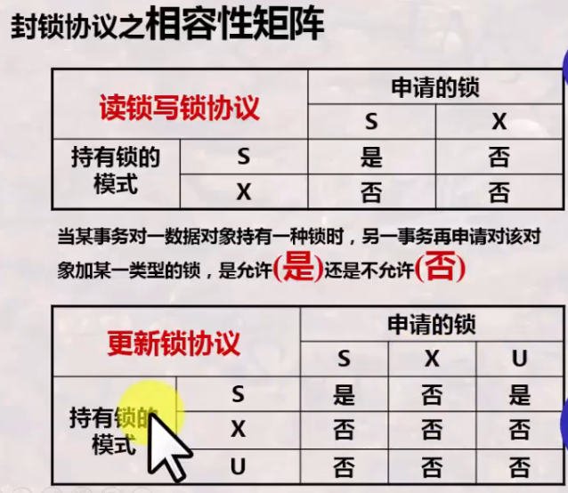
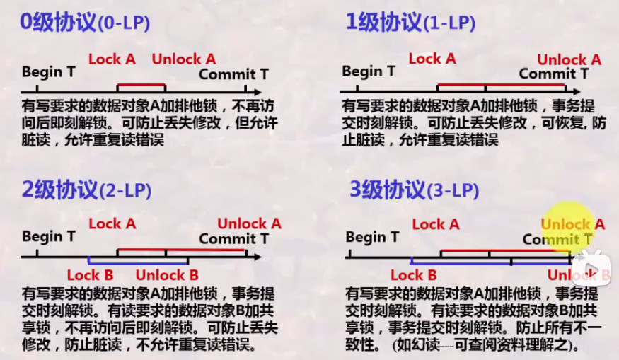
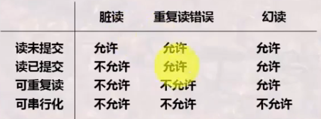
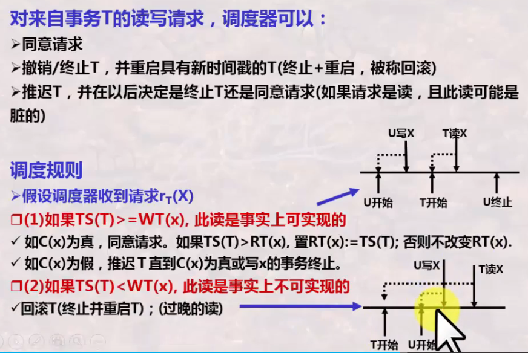
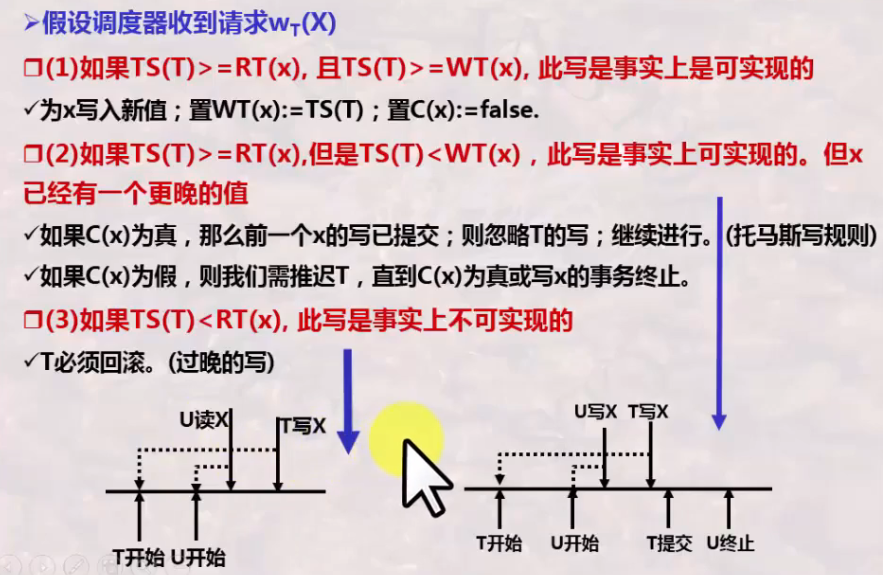
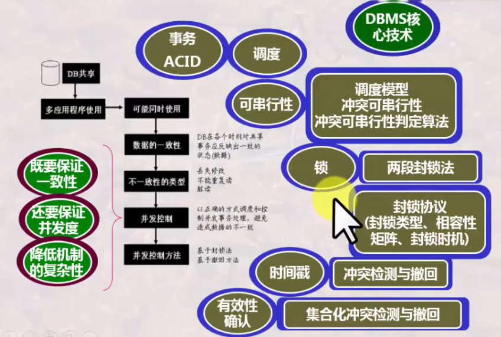

# 数据库系统 战德辰
## 第22讲 数据库事务处理技术之并发控制
### 为什么需要并发控制
* 数据库可能存在不一致
    * 丢失修改
    * 不能重复读(重复读错误)
    * 脏读
* 并发控制方法
    * 基于封锁法
    * 基于撤回方法
* 并发控制及相应的事务处理技术是数据库管理系统的核心技术
* 事务
    * 是数据库管理系统提供的控制数据操作的一种手段, 以此保障数据库的正确性、一致性
    * 事务的宏观性: 一个存取或改变数据库内容的程序的一次执行被看作一个事务
    * 循环多少次, 则将产生多少个事务
    * 事务的微观性: 对数据库的一系列基本操作的一个整体性执行
    * 宏观独立完整、微观交错执行
* 并发控制就是通过事务微观交错执行次序的正确安排, 保证事务宏观的独立性、完整性、准确性
* 事务的特性: ACID(原子性/一致性/隔离性/持久性), 具有ACID特性的若干数据库基本操作的组合体称为事务
* 事务管理器
    * 产生事务
    * 管理事务的时间戳
    * 管理事务的一系列操作
* 事务调度器
    * 对所有事务的操作产生一个读写操作序列
    * 保证事务的一致性
    * 锁表
### 事务调度及可串行性
* 事务调度
    * 一组事务的基本步的一种执行顺序称为对这组事务的一个调度
    * 并发调度的正确性: 当且仅当在这个并发调度下所得到的新数据库结果与分别串行运行这些事务所得的数据库完全一致, 则说调度是正确的
    * 可串行性: 不管数据库初始状态如何, 一个调度对数据库状态的影响都和某个串行调度相同, 则说这个调度是可串行化的
    * 并行调度的正确性指的是内容上结果的正确性、可串行性指的是形式上结果正确性
    * 可串行化调度一定是正确的并行调度, 但正确的并行调度未必是可串行化调度
    * 可串行化调度的等效串行序列不一定唯一
* 冲突: 调度中一对连续的动作, 它们满足: 如果它们的顺序交换, 那么涉及的事务中至少有一个事务的行为会改变
    * 有冲突的两个操作是不能交换次序的, 没有冲突的两个事务是可交换的
    * 冲突的情况
        * 同一事务的任何两个操作都是冲突的
        * 不同事务对同一元素的两个写操作是冲突的
        * 不同事务对同一元素的一读一写操作是冲突的
    * 冲突可串行性: 一个调度, 如果通过交换相邻两个无冲突的操作能够转换到某一个串行的调度, 则称此调度为冲突可串行化的调度  
    
### 基于封锁的并发控制方法
* "锁"是控制并发的一种手段
    * 每一数据元素都有一唯一的锁
    * 每一事务读写数据元素前, 要获得锁
    * 如果被其它事务持有该元素的锁, 则要等待
    * 事务处理完成后要释放锁
* 锁本身并不能保证冲突可串行性, 只是为调度提供了控制的手段, 但如何用锁仍需说明
* 锁的类型 -> 提高并发度, 保证正确性
    * 排他锁X/写锁(只有一个事务能读、写, 其它任何事务都不能读、写)
    * 共享锁S/读锁(所有事务都可以读, 但任何事务都不能写)
    * 更新锁U(初始读, 以后可升级为写)
    * 增量锁I(区分增量更新和其它类型的更新)
* 相容性矩阵: 当某事务对一数据对象持有一种锁时, 另一事务再申请对该对象加某一类型的锁, 是否允许  
    
* 加锁/解锁的时机
    
* SQL之隔离性级别
    * 读未提交——相当于0级协议
    * 读已提交——相当于1级协议
    * 可重复读——相当于2级协议
    * 可串行化——相当于3级协议
    * 
    * 幻读指的是事务不是串行发生时的一种现象, 事务A读取了事务B已提交的新增数据
        * 解决幻读的方法是增加范围锁或表锁
* 封锁粒度: 封锁数据对象的大小
    * 单位: 属性值->**元组**->元组集合->整个关系->整个DB某索引项->整个索引
    * 由前往后, 并发度小到大, 封锁开销小到大
* **两段封锁协议**是一种基于锁的并发控制方法
    * 读写数据之前要先获得锁, 每个事务中所有封锁请求先于任何一个解锁请求
    * 分为加锁段和解锁段, 加锁段不能解锁, 解锁段不能加锁
    * 两段封锁协议可以保证冲突可串行性, 但是可能产生死锁
### 基于时间戳的并发控制方法
* 时间戳: 一种基于时间的标志, 将某一时刻转换成的一个数值, 具有唯一性和递增性
* 事务的时间戳
    * 事务T启动时, 事务将该时刻赋予T
    * 时间戳可以表征一系列事务执行的先后次序, 时间戳小的先执行
    * 借助时间戳, 强制使一组并发事务的交叉执行, 等价于一个特定顺序的串行执行
    * 强制: 执行时判断冲突
        * 无冲突, 予以执行
        * 有冲突, 撤销事务并重启事务, 重启后该事务获得一个更大的时间戳, 表明是后执行的事务
    * 冲突
        * 读-读无冲突
        * 读-写或写-读冲突
        * 写-写冲突
* 一种简单的调度规则
    * 对DB上的每个数据元素X, 系统保留其上的最大时间戳
        * RT(x) 读最大时间戳; WT(x) 写最大时间戳
        * 先执行的先操作, 后执行的后操作
    * 放行一些事实上可实现的冲突——**托马斯写规则**
        * 过时的写操作可直接被忽略, 而无需撤销过时的事务
* 另一种调度规则
    * 增加C(x): x的提交位
    * 该位为真当且仅当最近写x的事务已经提交
    * 目的是避免出现事务读另一事务U所写数据然后U终止的情况
    *   
      
    
### 基于有效性确认的并发控制方法
* 事务在启动时刻被赋予唯一的时间戳, 以示其启动顺序
* 为每一活跃事务保存其读写数据的集合, 通过对多个事务的读写集合判断是否有冲突, 来完成事务提交与回滚
* 分为三个阶段: 读阶段/有效性确认阶段/写阶段
* 每个成功确认的事务是在有效性确认的瞬间执行的
* 调度器维护三个集合
    * START 已经开始但尚未完成有效性确认的事务集合, 维护START(T)即事务T开始的时间
    * VAL 已经确认有效性但尚未完成写的事务, 维护START(T)和VAL(T)即事务T确认的时间
    * FIN 已经完成第三阶段的事务, 记录START(T), VAL(T)和FIN(T)即事务T完成的时间
* 有效性确认规则  

### 总结
  
