# 数据库系统 战德辰
## 第23讲 数据库事务处理技术之故障恢复
### 数据库的故障
* 故障恢复涉及到如何保证事务的原子性和持久性
* 数据库的故障及其影响
    * 事务故障: 某一个程序(事务)自身运行错误所引起的故障, 只影响该程序本身
    * 系统故障: 由于掉电、非正常关机等所引起的故障, 影响正在运行的事务及数据库缓冲区(可能涉及已经运行的事务)
    * 介质故障: 由于介质损坏等引起的故障, 影响是全面的, 既影响内存中的数据, 又影响介质中存储的数据
### 数据库故障恢复的宏观思路
* 数据库故障恢复: 把DB由当前不正确状态恢复到已知为正确的某一状态
    * 事务故障的恢复: 可通过重做事务和撤销事务来恢复, 前者保证已提交事务的持久性, 后者消除未提交事务对系统的影响
    * 系统故障的恢复: 通过运行日志(DBMS维护的记录操作的文件)来恢复, 按照运行日志记录的事务操作顺序重做事务
        * DBMS在运行日志中定期设置和更新检查点, 在该时刻DBMS强制使内存DB Buffer中的内容与介质DB中的内容保持一致, 即将DB Buffer更新的所有内容写回DB中, 说明在检查点之前内存中数据与介质中数据保持一致
        * 检查点之前结束的事务不需要恢复, 检查点之后结束或发生的事务需要依据运行日志进行恢复
    * 介质故障的恢复: 通过副本(在某一时刻对数据库在其它介质存储上产生的另一份等同记录)替换被损坏的数据库
        * 由于介质故障影响全面, 在用副本恢复后还需要依据运行日志进行恢复
        * 问题: 如何确定备份的时刻-转储点: 过频影响系统工作效率, 过疏造成运行日志过大, 影响系统运行性能
        * 备份转储周期与运行日志的大小密切相关, 应注意防止衔接不畅而引起的漏洞
### 运行日志及其检查点
* 事务涉及到的  
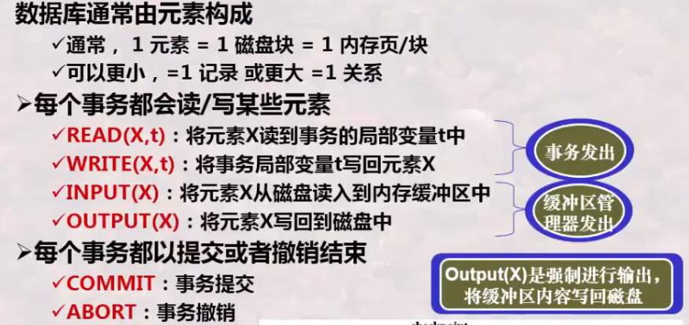
* 缓冲区处理策略
    * Force: 内存中的数据最晚在commit的时候写入磁盘
    * No steal: 不允许事务commit之前把内存中的数据写入磁盘
    * No force: 内存中的数据可以一直保留, 在commit之后过一段时间再写入磁盘(在系统崩溃时可能还没写入磁盘, 需要redo)
    * Steal: 允许在事务commit之前把内存中的数据写入磁盘(若系统崩溃, 要恢复到崩溃前的状态需要undo)
    * 当前最常用的 Steal + No force
* 日志
    * 一个包含日志记录的只能追加的顺序文件, 按发生时间存储
    * 发生系统故障时, 使用日志进行恢复
    * 三种日志: Undo型日志、Redo型日志、Undo/Redo型日志
* 缓冲区处理策略与日志/恢复策略的关系
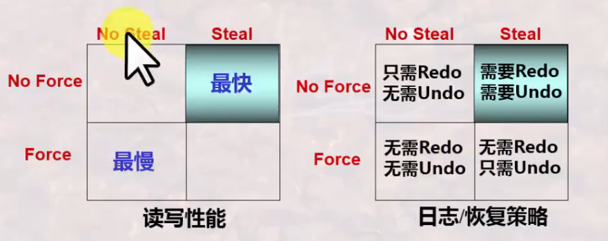
### 三种类型的运行日志&运用运行日志进行故障恢复
* Undo型日志及其故障恢复  
    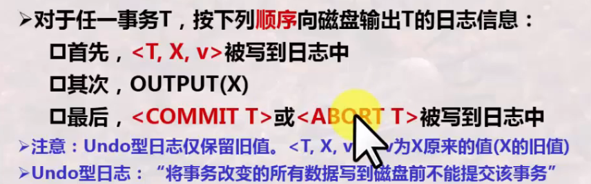
    * 利用undo型日志进行恢复  
    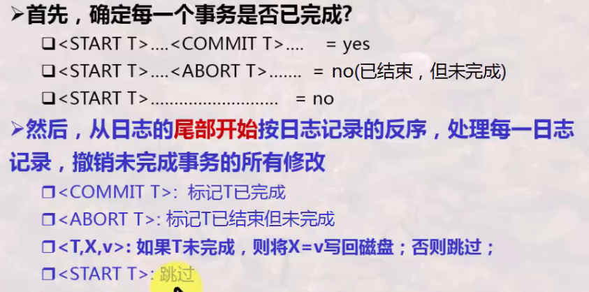
    * 检查点
        * 静止检查点: 周期性地对日志设置检查点
            * 停止接受新的事务, 等到所有当前活跃事务提交或终止后
            * 将日志刷新到磁盘, 写入日志记录\<CKPT\>, 再次刷新日志
        * 非静止检查点: 在设置检查点时不必关闭系统, 允许新事务进入
            * 写入\<START CKPT(T1,...,TK)\> 为所有活跃的未结束的事务
            * 继续正常操作, 直到这些事务都完成, 写入\<END CKPT\>
        * 故障需恢复到所遇到的第一个检查点<CKPT>
* Redo型日志及其故障恢复  
    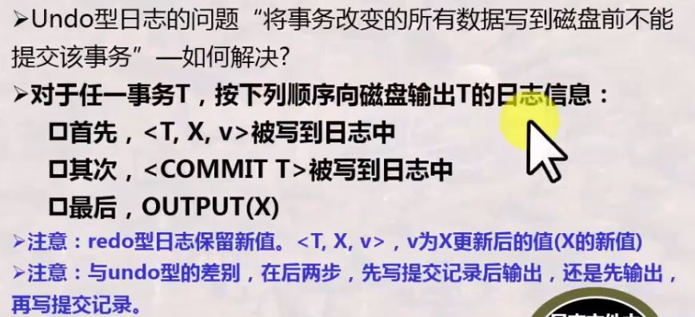
    * 利用redo型日志进行恢复  
    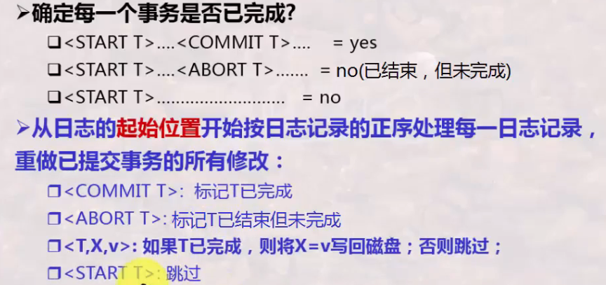
    * 检查点
        * 非静止检查点: 在设置检查点时不必关闭系统, 允许新事务进入
            * 写入\<START CKPT(T1,...,TK)\> 为所有活跃的未结束的事务
            * 继续正常操作, 直到这些事务都完成, 写入\<END CKPT\>
        * 故障需恢复要寻找到最后的\<END CKPT\>, 从其内容的最早开始处恢复起, 忽略更早提交的事务
* Undo/Redo结合型日志及其故障恢复  
    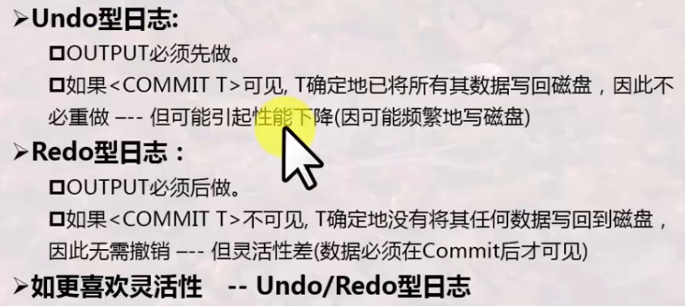  
    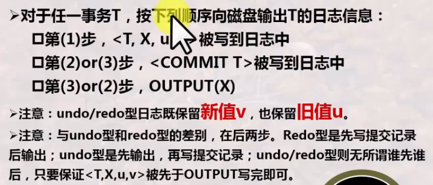
    * 利用undo/redo型日志进行恢复  
    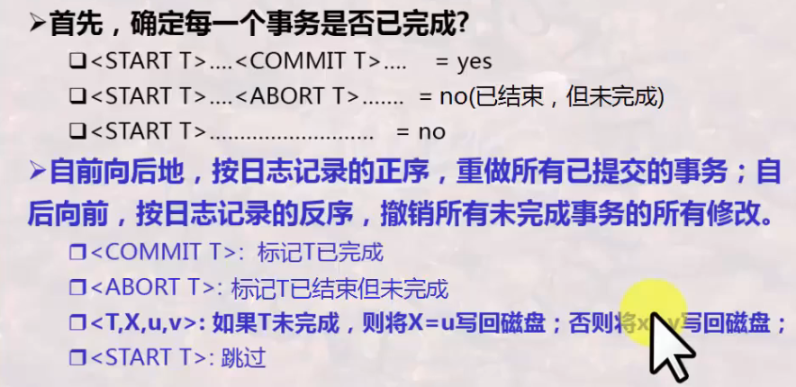  
    * 既需要做撤销的工作, 又需要做重做的工作
### 总结
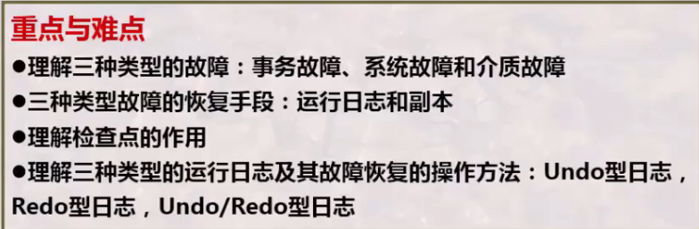  
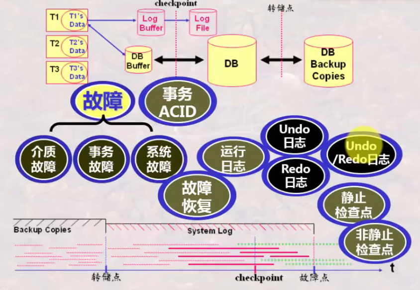