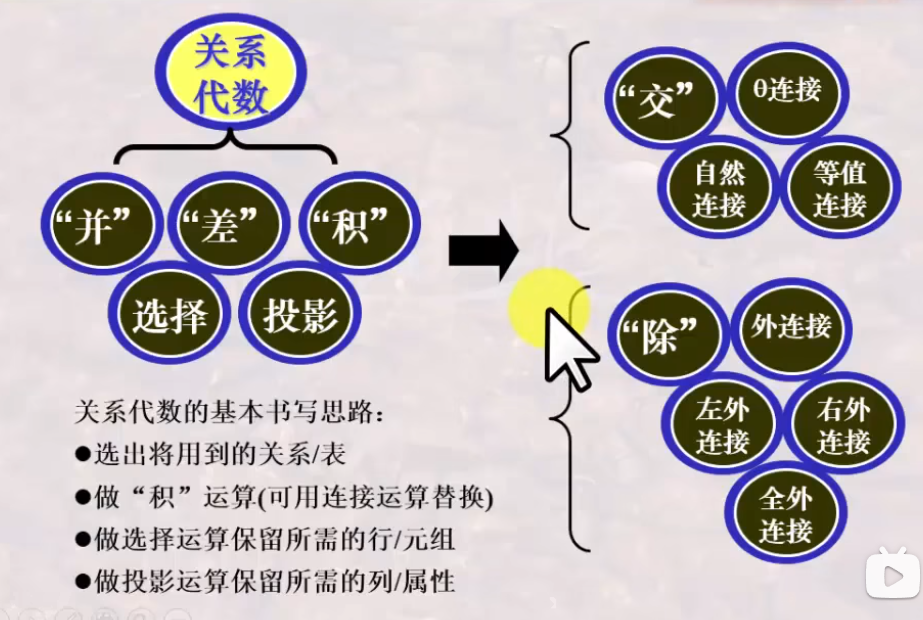
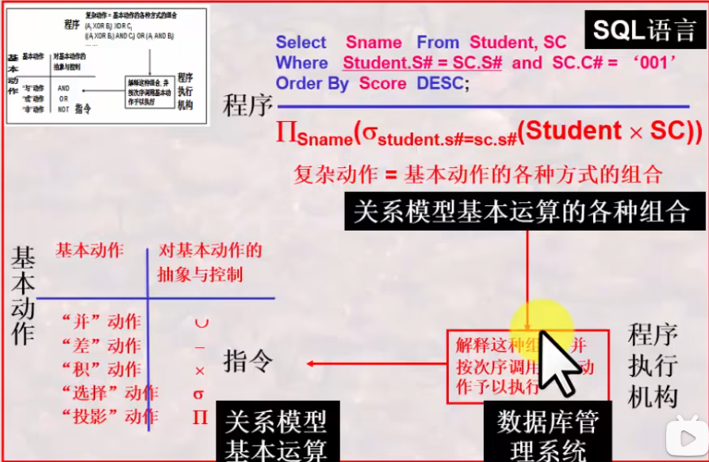

# 数据库系统 战德辰
## 第4讲 关系模型之关系代数
### 关系代数之基本操作
**关系代数运算的特点**  
* 基于集合, 提供了一系列的关系代数操作。
* 关系代数以一个或多个关系作为输入, 结果是一个新的关系。
* 具有一定过程性, 用对关系的运算来表达查询。
* 是一种抽象的语言, 是学习其它数据库语言的基础。

**基本操作**  
  
* 并(*并相容) R∪S = S∪R: 将两个关系的元组合并成一个关系, 在合并时去重。用于查询XXX、XXX中至少参加了一个的信息。
* 差(*并相容) R-S / S-R: 是...但不含..., 用于查询只参加XXX而未参加XXX的信息。
* 广义笛卡尔积 R×S = S×R: 关系R中的元组与关系S中的元组进行所有可能的组合拼接构成。拼接后元组数目相乘, 度数相加。用于检索涉及多个表时串接的运算。是后续学习各种连接运算的基础。
* 选择 σcon(R): 从关系R中选择出满足给定条件condition的元组构成。  

* 投影 ΠA(R): 从关系R中选出属性包含在A中的列构成, 在合并时去重(因为对于关系来讲是集合, 在实际运用时默认不去重)。

**关系代数运算的约束**  
* 某些操作, 如并、差、交等, 需满足并相容性 -> 关系R和关系S的属性数目相同, 且第i个属性的域(domain, 在table中表现为type)相同

### 关系代数之扩展操作
**扩展操作**
* 交(*并相容) R∩S = S∩R = R-(R-S) = S-(S-R): 由同时出现在关系R和关系S中的元组构成, 用于查询既参加XXX又参加XXX的信息。
* θ-连接(theta-join): R与S的θ连接运算结果也是一个关系, 记作。(可以理解为对笛卡尔积添加筛选条件)
* 更名 ρSC1(SC): 对表格进行更名以作为筛选条件的辅助操作。
* 等值连接(equi-join): θ-连接的特殊情况, 筛选条件中采用等值。
* 自然连接(natural-join): 等值连接的特殊情况, 要求关系R和关系S必须有相同的属性组B。R,S属性相同, 值必须相等才能连接。要在结果中去除重复的属性列。(实际上是最普遍使用的连接)
### 关系代数之组合与应用训练
练习章节, 略过。主要要求根据表达特别注意语义和顺序。  
**书写关系代数表达式的基本思路**  
  
### 关系代数之复杂扩展操作
 * 除 R÷S: 查询...全部的/所有的..., 要求除属性集S是被除属性集R的真子集。结果的度数k=n-m。  
   验证方法: (R÷S)×S的元组都在R的元组中。  
   ep: 查询选修了全部课程的学生的学号。
 * 外连接(outer-join): 与θ-连接相比, 连接时不会丢失元素(失配信息记为空值)。又进一步细分为左外连接、右外连接、全外连接。
### 总结
  
**关系代数的基本书写思路**  
1. 选出将用到的关系/表
2. 做积运算(可用连接运算替换)
3. 做选择运算保留所需的行/元组
4. 做投影运算保留所需的列/属性

**章节回顾**  
  
