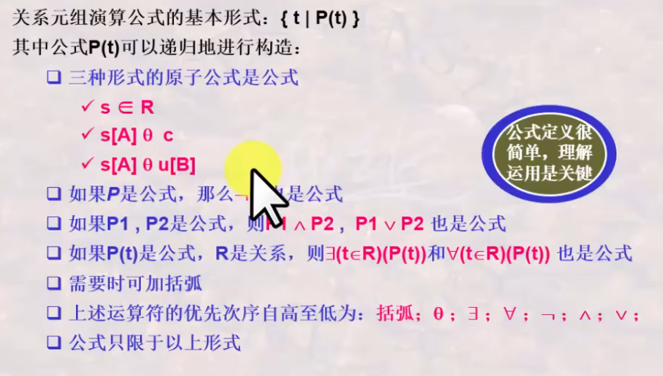
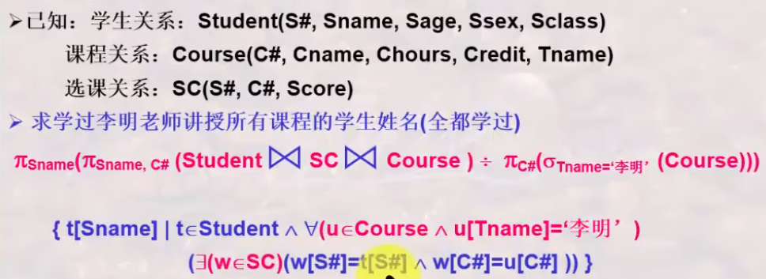
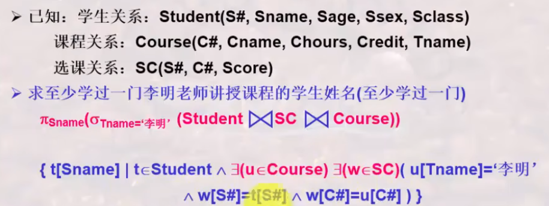
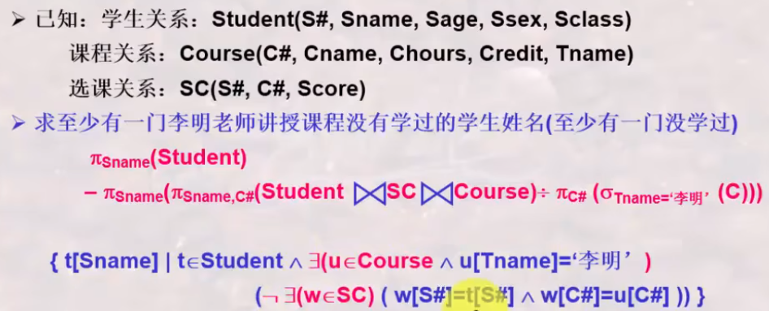
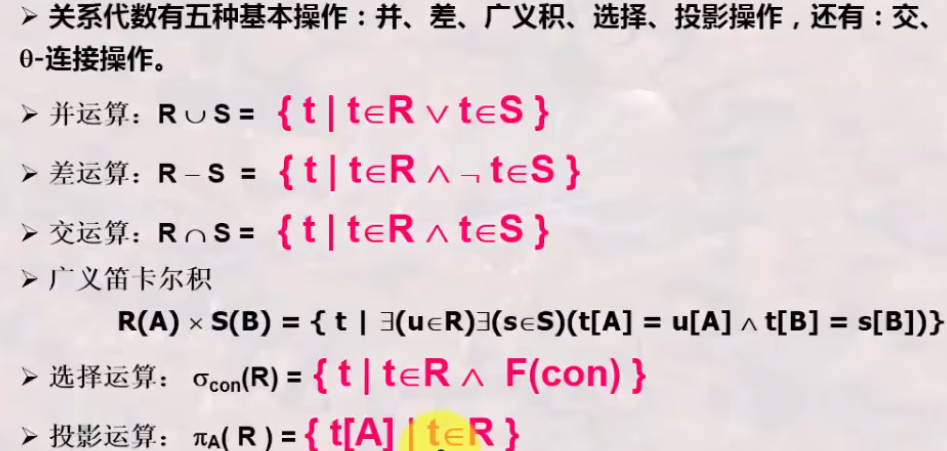
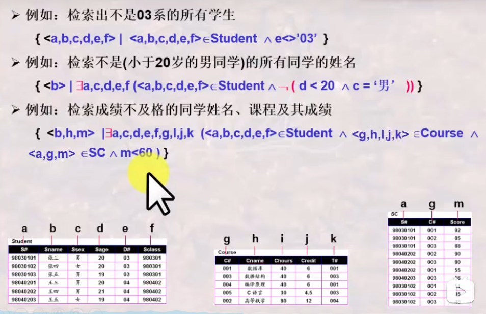
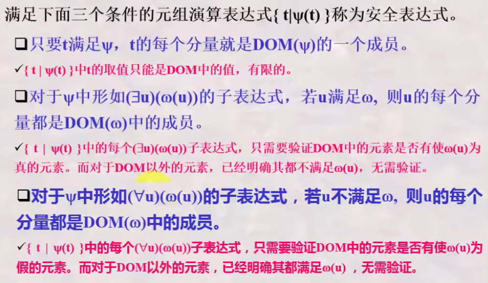
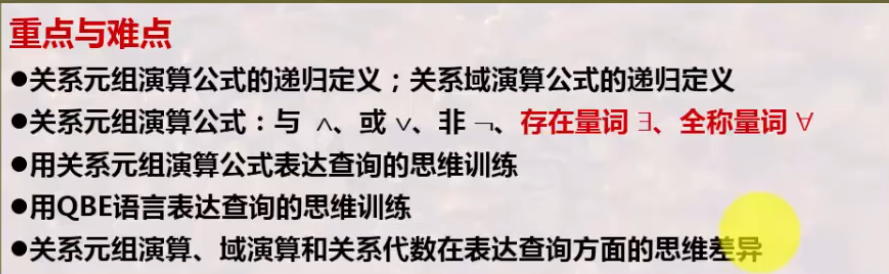

# 数据库系统 战德辰
## 第5讲 关系模型之关系演算
### 关系演算之关系元组演算
按照谓词变量的不同, 可分为**关系元组演算**(以元组变量作为谓词变量的基本对象)和**关系域演算**(域变量)  
基本形式: {t|P(t)} 表示所有使谓词P为真的元组t的集合  

  
注意运算符优先次序(括弧;θ;全称量词;取反;and;or)导致的结果差异！
* 被存在量词或全称量词限定的元组变量被称为**约束变量**, 否则被称为**自由变量**。
* **存在量词**: 全假则假, 一真则真; **全称量词**: 全真则真, 一假则假  

**这一段的训练题非常多, 涉及到离散数学/概率论中的逻辑。可以看原视频深入了解。**  
**四个最复杂的例子**
1. "全都学过": 视频44:09
  
2. "全没学过": 视频49:32
  
3. "至少有一学过" 视频52:40
  
4. "至少有一没学过" 视频53:50
  

元组演算公式与关系代数的等价性  
  

### 关系演算之关系域演算
1. **关系域演算公式**  
  基本形式: {<x1,x2,...,xn>|P(x1,x2,...,xn)}  
  其中xi代表域变量或常量, P为以xi为变量的公式
2. **构造示例**  
  
3. **基于关系域演算的QBE语言**
  * 特点: 操作独特, 基于屏幕表格的查询语言, 只需将条件填在表格中
  * 是一种高度非过程化的查询语言
  * 适合终端用户的使用
  * 操作框架由四个部分构成: 关系名区, 属性名区, 操作命令区, 查询条件区
  * 操作命令: P.(Print), D.(Delete), I.(Insert), U.(Update)
  * 查询条件形式为 θ 参量(省略θ则默认为=)
  * 示例元素与投影: 
    * 用任何一个值带有下划线表示, 被称为示例元素
    * 只用于占位(通过表格反映查询条件)
    * 符号也可写在操作区, 表示对整行生效
    * 可利用同一连接条件使用相同的示例元素, 实现多个表的连接  
  * PS: 视频1:23:00有误, 满足例子条件的应该放在同一行。视频中的表格实现的是年龄大于19岁或男同学。  
### 关系演算之安全性
**不产生无限关系和无穷验证的运算被称为是安全的**
 * 关系代数是一种集合运算, 是安全的(集合本身是有限的)
 * 关系演算不一定是安全的(R(t)是有限的, 但不在R(t)中的元素可能是无限的)
 
所以需要对关系演算施加约束条件, 即**安全约束有限集合DOM**: 其为一个有限集合, 其中的每个符号要么是公式中明显出现的符号, 要么是出现在公式中的某个关系R的某元组的分量。  
**安全元组演算表达式**  
  
**安全域演算表达式**  
同理。课程视频中未介绍。
### 关于三种关系运算的观点
 * 关系运算有三种: 关系代数、关系元组演算和关系域演算
 * 三种关系运算都是抽象的数学运算, 体现了三种不同思维(以元组、集合、域变量为对象)
 * 三种运算之间是(有条件: 即安全的元组/域演算表达式)等价的
 * 三种运算都可以说是非过程性的: 域演算>元组演算>关系代数
 * 三种关系运算虽然是抽象的, 但是是衡量数据库语言完备性的基础
 * 数据库语言可以基于这三种抽象运算来设计
### 总结
  
本讲主要是基于逻辑的思维, 讨论从关系演算->元组演算/域演算, 涉及到与、或、非、存在量词、全称量词。  