# 数据库系统 战德辰
## 第8讲 SQL语言与数据库完整性和安全性
### 数据库完整性的概念及分类
**概念**
 * 数据库完整性指的是DBMS应保证的DB的一种特性——在任何情况下的正确性、有效性和一致性
 * 广义: 语义完整性、并发控制、安全空值、DB故障恢复
 * 狭义: 专指**语义完整性**, DBMS通常有专门的完整性管理机制与程序来处理语义完整性问题(本讲专指此)
 * 不正当的数据库操作引发数据库完整性问题

**数据库完整性管理的作用**
 * 防止和避免数据库中不合理数据的出现
 * DBMS应尽可能地自动防止DB中语义不合理现象的出现

**怎样保证完整性**
 * 允许用户(DBA)定义一些完整性约束规则
 * 当有DB更新操作时, DBMS自动按照完整性约束条件进行检查以确保更新操作符合语义完整性

**完整性规则 ::=(O,P,A,R)**
 * O: 数据集合: 约束的对象
 * P: 谓词条件: 什么样的约束
 * A: 触发条件: 什么时候检查
 * R: 响应动作: 不满足时怎么办

**完整性的分类**
 * 按约束对象分类
   * 域完整性约束条件: 施加于某一列上(仅涉及到一列)
   * 关系完整性约束条件: 施加于关系/table上(可能涉及到多列)
 * 按约束来源分类
   * 结构约束: 来自模型的约束, 例如函数依赖约束、主键约束、外键约束
   * 内容约束: 来自用户的约束, 例如用户自定义完整性
 * 按约束状态分类
   * 静态约束: DB在任一时候均应满足的约束
   * 动态约束: 要求DB从一状态变为另一状态时应满足的约束

### SQL语言之列约束与表约束——静态约束
**SQL语言支持的约束类别**
 * 静态约束: 列完整性、表完整性
 * 动态约束: 触发器

**实现约束的方法——Create Table**
 * 表约束通过逗号区分开这一列, 列约束则是随每一列而定义
 * Col_constr列约束  
 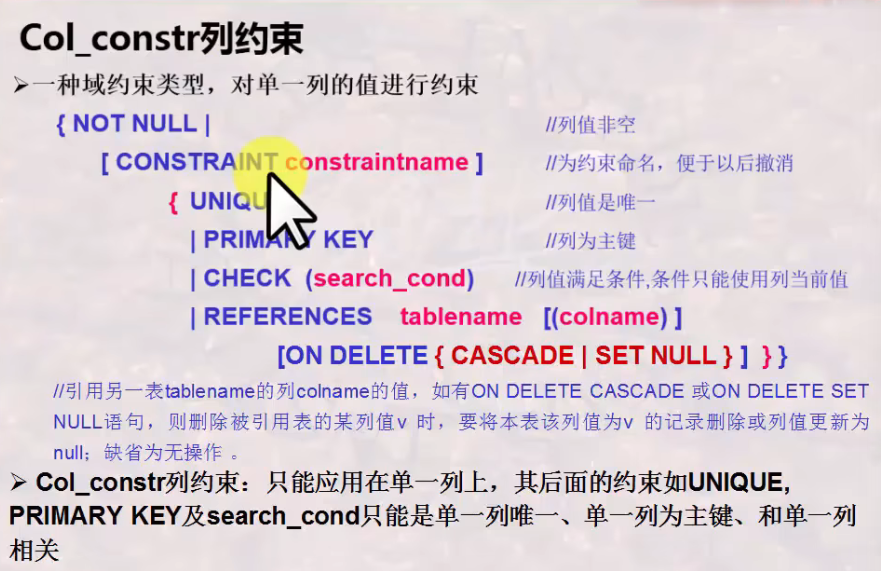
 * table_constr表约束  
 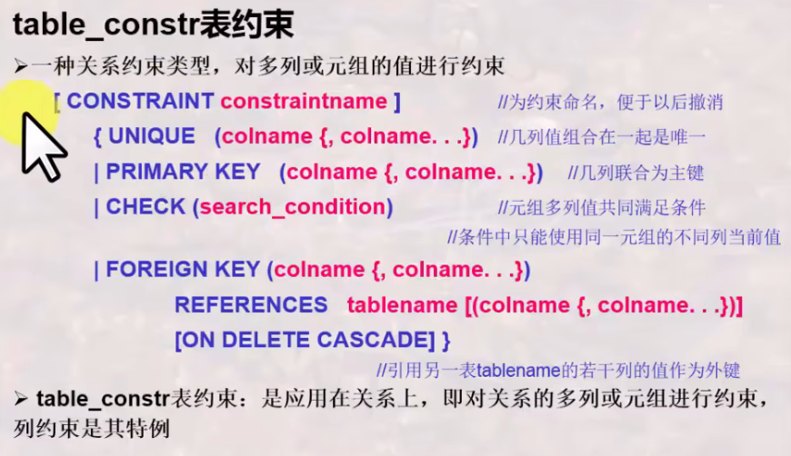
 * 撤销/追加约束(不同系统可能有差异)
 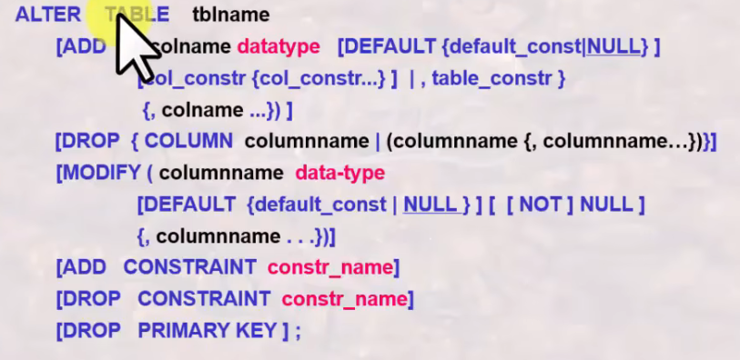

**实现约束的方法——断言**
 * 就是一个谓词表达式, 表达了希望数据库总能表达的体哦阿健
 * 表约束和列约束就是特殊的断言
 * SQL还提供了复杂条件表达的断言: CREATE ASSERTION <断言名> CHECK <条件>
 * 断言测试会增加数据库维护的负担, 要小心使用复杂的断言
### SQL语言之触发器——动态约束
 * trigger是一种过程完整性约束, 可以在特定的时刻被自动触发执行
 * 基本语法  
 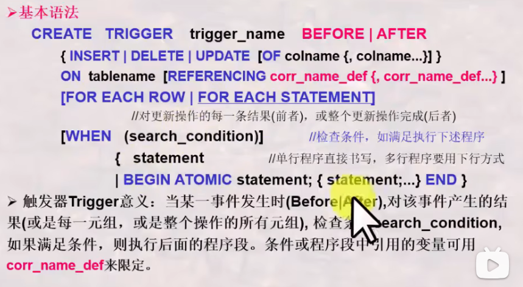

 * 新旧值用old_row_corr_name/new_row_corr_name/old_table_corr_name/new_table_corr_name区分
 * referencing new x, old y
### 阶段性总结
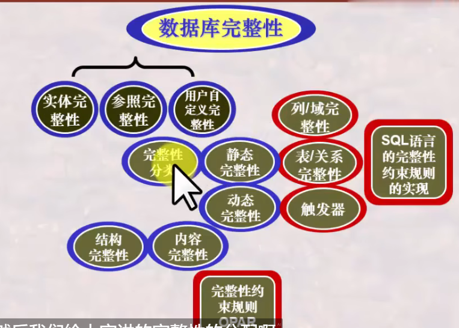
### 数据库安全性的概念及分类
 * 概念: 数据库安全性是DBMS应该保证的数据库的一种特性: 免受非法、非授权用户的使用、泄漏、更改、破坏
 
**DBMS的安全机制**
 * 自主安全性控制: 存取控制: 通过权限在用户之间的传递使得用户自主管理数据库安全性
 * 强制安全性控制: 通过对数据和用户强制分类, 使得不同类别用户能访问不同类别的数据
 * 推断控制机制: 防止通过历史信息推断出不该被其知道的信息；防止通过一些信息推断出私密信息
 * 数据加密存储机制: 通过加密、解密保护数据

**DBA的责任和义务**
 * 划分好数据的安全级别以及用户的安全级别, 实施安全性控制

**数据库自主安全性机制的实现**
 * DBMS允许用户定义一些安全性控制规则(用SQL-DCL定义)
 * 安全性访问规则: AccessRule ::=(S,O,t,P)
   * S: 请求主体(用户)
   * O: 访问对象
   * t: 访问权利
   * P: 谓词
 * AccessRule通常存放在数据字典或系统目录中, 构成了所有用户对DB的访问权利
 * 用户多时, 可以按用户组建立访问规则

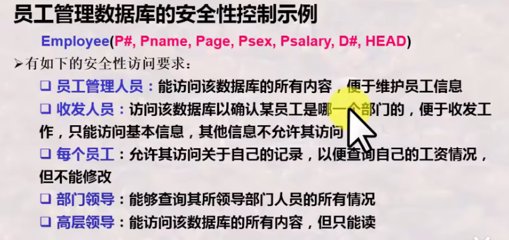  
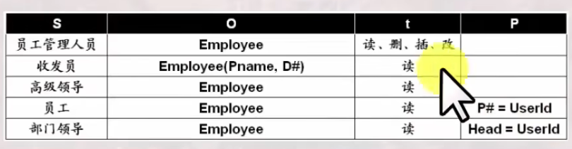

 * 亦可使用视图(view)进行安全性控制
 * 用户定义视图后，其便成为一个新的数据对象，参与到存储矩阵与能力表中描述
### SQL语言之安全性实现
**SQL语言的用户与权利**  
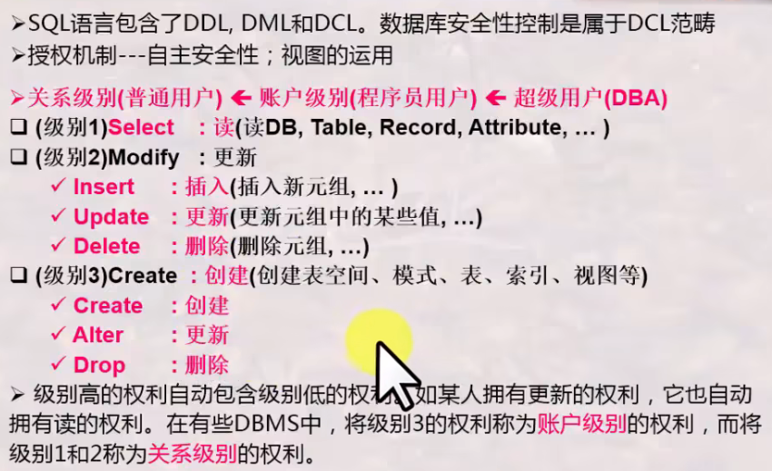

**SQL-DCL的命令及其应用**  
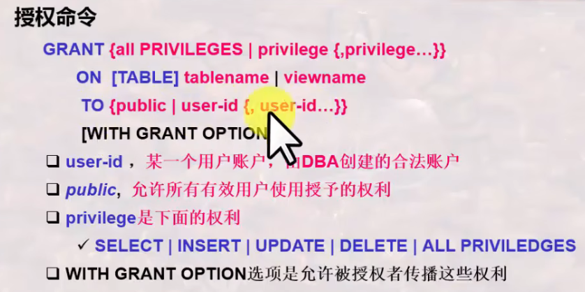  
 * 授予视图权利不代表授予基本表权利
 * 授权者授予的权利必须是授权者已有的权利

(public为授权给所有用户)  

**授权的传播范围**  
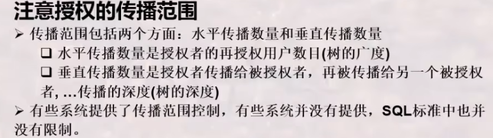  
 * 当一个用户的权利被收回时, 通过其传播给其它用户的权利也将被收回

**强制安全性机制**
 * 通过对数据对象进行安全性分级: Top Secret/Secret/Confidential/Unclassified
 * 同时对用户也进行上述的安全性分级
 * 强制实现不同级别用户访问不同级别数据的一种机制
 * 但是高级别用户不允许写低级别数据
 * DBMS引入强制安全性机制, 可以通过扩展关系模式来实现, 使得关系中的每个元组扩展为带有安全分级的元组
### 阶段性总结
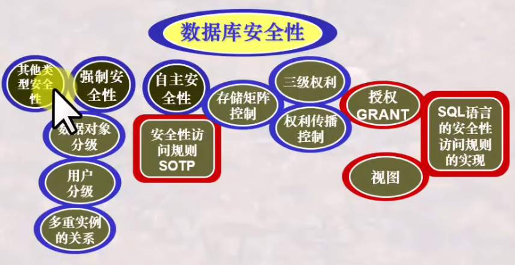
### 总结
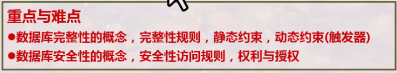