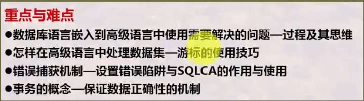
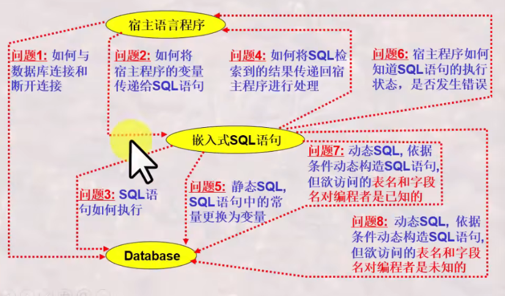
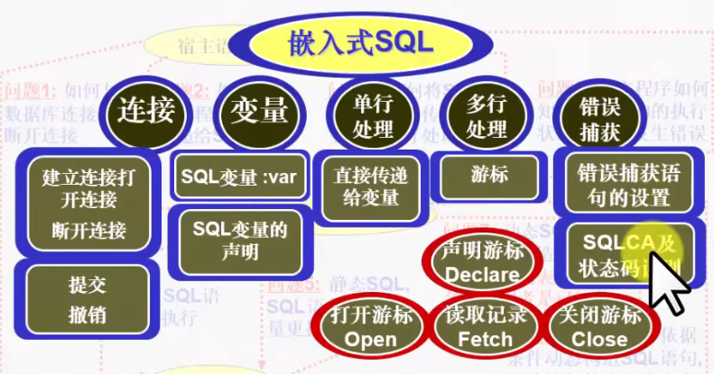

# 数据库系统 战德辰
## 第9讲 嵌入式SQL语言之基本技巧
### 嵌入式SQL语言概述
**交互式SQL语言的局限**
  * 大部分普通用户难以使用
  * 特别复杂的检索结果难以用一条交互式SQL语句完成

**高级语言 + SQL语言**
  * 既继承高级语言的过程控制性
  * 又结合SQL语言的复杂结果集操作的非过程性
  * 同时又为数据库操作者提供安全可靠的操作方式: 通过应用程序进行操作

**典型特点(以宿主语言C语言为例)**
  * exec sql引导SQL语句
  * 增加into子句: 指出接收SQL语句检索结果的程序变量
  * 由冒号引导的程序变量

**高级语言中使用嵌入式SQL语言需要解决的问题**
  * 如何与数据库连接和断开连接
  * 如何将宿主程序的变量传递给SQL语句
  * SQL语句如何执行
  * 如何将SQL检索到的结果传递回宿主程序进行处理
  * 静态SQL, SQL语句中的常量更换为变量
  * 宿主程序如何知道SQL语句的执行状态, 是否发生错误
  * 动态SQL, 依据条件动态构造SQL语句, 但欲访问的表名和字段名对编程者是已知的
  * 动态SQL, 依据条件动态构造SQL语句, 但欲访问的表名和字段名对编程者是未知的
### 变量声明与数据库连接
**变量赋值时需要注意**
  * 宿主程序的字符串变量长度应比字符串字段的长度多1个(终止符\\0)
  * 宿主程序变量类型与数据库字段类型之间有些是有差异的, 有些DBMS可以支持自动转换, 有些不能
  * 声明的变量可以在宿主程序中赋值, 然后传递给SQL语句

**程序与数据库的连接和断开**
  * 在嵌入式SQL程序执行前要先连接数据库
  * 连接语法(SQL标准中所建议的)
    * exec sql connect to target-server as connect-name user user-name;
    * exec sql connec to default;
  * 断开连接语法(SQL标准中所建议的)
    * exec sql disconnect connect-name;
    * exec sql disconnect current;

**SQL语句的执行和撤销**
 * 在执行过程中必须有提交和撤销语句才能确认其操作结果
 * SQL执行的提交: exec sql commit work;
 * SQL执行的撤销: exec sql rollback work;

**事务的概念与特性**
 * 概念: (管理员角度)是一个存取或改变数据库内容的程序的一次执行(可以是一条或多条SQL语句)
 * 概念: (DBMS角度)是数据库管理员提供的控制数据操作的一种手段, 以便数据库管理系统能提供一致性状态转换的保证
 * (要保证一组操作或者全都执行, 或者都不执行)
 * 任何一条数据库操纵语句都会引发一个新事务的开始, 而事务的结束需要通过commit或rollback确认
 * 特性(ACID)
   * A原子性(保证事务的一组更新操作原子不可分)
   * C一致性(保证事务的操作状态正确)
   * I隔离性(保证并发执行的多个事务之间互相不受影响)
   * D持久性(保证已提交事务的影响是持久的, 被撤销事务的影响是可恢复的)
 * 具有ACID特性的若干数据库基本操作的组合体被称为事务
 * 事务处理是DBMS的核心技术
 * 示例
   * 引入SQLCA
   * 设置声明变量
   * 设置SQL错误捕获语句
   * 连接数据库
   * 设置SQL语句, 进行提交
   * 断开连接
### 数据集与游标
 * 检索单行结果, 可将结果之间传送到宿主语言的变量中
 * 检索多行结果, 则需使用游标(cursor)
   * 游标是指向某检索记录集的指针
   * 通过这个指针的移动, 每次读一行, 处理一行, 再读一行,...,直至处理完毕
   * 读一行操作是通过fetch...into语句实现的
   * 记录集有结束标识EOF, 用来标记后面已没有记录了
 * 游标的使用需要先定义, 再打开, 再处理数据, 最后关闭
 * 游标可以定义一次, 多次打开, 多次关闭
 * cursor的定义: exec sql declare cursor_name cursor for ...;
 * cursor的打开和关闭: exec sql open/close cursor_name;
 * cursor的数据读取: exec sql fetch cursor_name into host-variable, \[host-variable,...\];
### 可滚动游标与数据库的增删改
 * 标准的游标始终是自开始向结束方向移动的; 一条记录只能被访问一次; 再次访问该记录只能关闭游标后重新打开
 * ODBC提供了可滚动cursor的解决方案。许多DBMS不支持可滚动游标, 但是通过ODBC可以使用该功能
 * 新增\[SCROLL\]选项
   * NEXT向结束方向移动一条
   * PRIOR向开始方向移动一条
   * FIRST回到第一条
   * LAST移动到最后一条
   * ABSOLUT value_spec 定向检索指定位置的行
 * 可滚动游标移动时需要判断是否到结束或起始位置(EOF/BOF, 不需区分则可通过whenever not found语句设置来检测)
### 数据的删除与更新
 * 查找删除: 与交互式delete语句相同
 * 定位删除: 删除游标位置的数据(where current of delcust)
 * 查找更新: 与交互式update语句相同
 * 定位更新: 更新游标位置的数据(where current of declust)
 * 插入: 与交互式insert into语句相同
### 状态捕获及错误处理机制
 * 状态: 是嵌入式SQL语句的执行状态, 尤其指一些出错状态
 * 在嵌入SQL中, 状态捕获与处理的构成
   * 设置SQL通信区(exec sql include sqlca;)
   * 设置状态捕获语句(exec sql whenever sqlerror goto report_error;)
   * 状态处理语句(report_error: exec sql rollback;)
 * SQLCA是一个已被声明果的具C语言的结构形式的内存信息区, 是DBMS与宿主程序之间交流的桥梁
 * 状态捕获语句: exec sql whenever condition action; 设立条件陷阱
   * SQLERROR: 检测是否有SQL语句出错, 具体意义依赖于DBMS
   * NOT FOUND: 没有相应的结果记录
   * SQLWARNING: 不是错误, 但是应当引起注意的条件
   ---
   * CONTINUE: 忽略条件或错误, 继续执行
   * GOTO 标号: 转移到标号所指示的语句
   * STOP: 终止程序运行、撤销当前工作、断开数据库连接
   * DO/CALL: 调用宿主程序的函数进行处理, 函数返回后从引发该condition的SQL语句之后的语句继续执行
 * 状态捕获语句whenever的使用容易引发无限循环, 在处理函数中忽略其中的错误可避免无限循环
 * 状态记录方法
   * sqlcode: >0:warning;<0:error;==0:successful
   * sqlca.sqlcode
   * sqlstate
### 总结
  
  
本讲讲解了问题1-6。  
